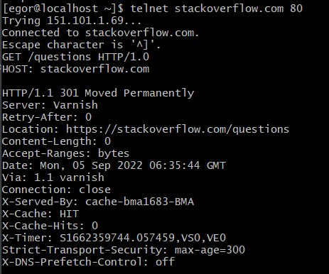
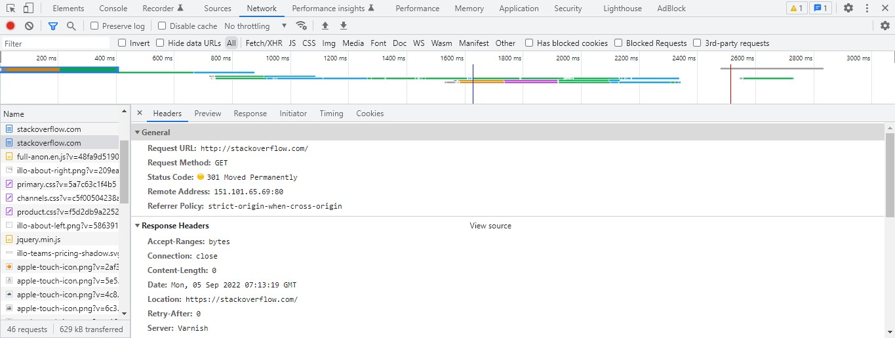
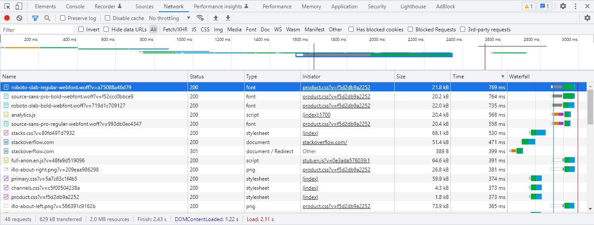
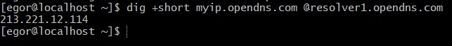
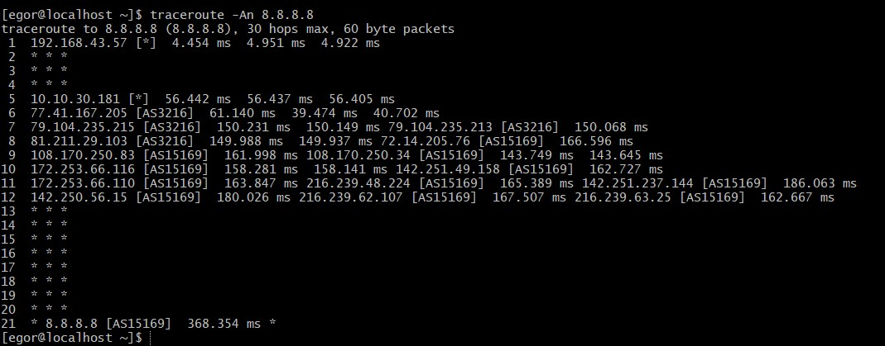
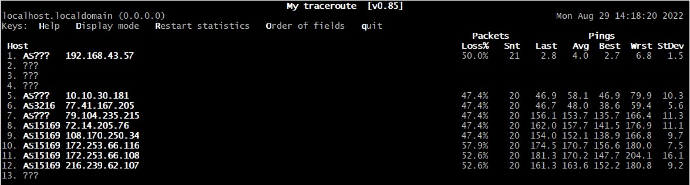
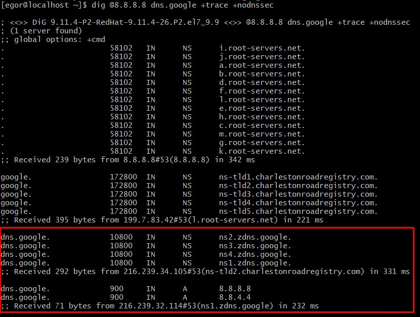
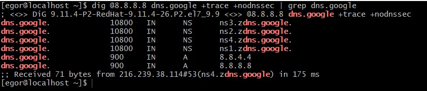
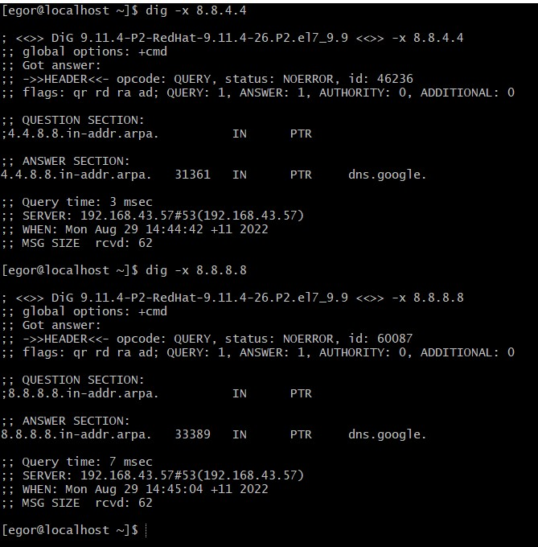

# devops-netology

## HomeWork 3.6
### Желобанов Егор DEVOPS-21

1. Подключился к сайту stackoverflow.com с помощью telnet, отправил HTTP запрос:
    
    * код перенаправления `301 Moved Permanently` протокола передачи гипертекста (HTTP) показывает, что запрошенный ресурс был окончательно перемещён в URL, указанный в заголовке `Location`.
2. Сделал то же самое в браузере, получил такой результат:
    
    * код перенаправления 301, тот же что и в предыдущем задании.
    * по времени загрузки, самый долгий запрос занял `769 мс`:
   
    
3. Мой ip в интернете - `213.221.12.114`. Узнал выполнив команду `dig +short myip.opendns.com @resolver1.opendns.com`:
    
4. Мой провайдер ПАО Вымпелком, номер автономной системы - AS16345:
    ```shell
    [egor@localhost ~]$ whois -h whois.ripe.net 213.221.12.114
    % This is the RIPE Database query service.
    % The objects are in RPSL format.
    %
    % The RIPE Database is subject to Terms and Conditions.
    % See http://www.ripe.net/db/support/db-terms-conditions.pdf
    
    % Note: this output has been filtered.
    %       To receive output for a database update, use the "-B" flag.
    
    % Information related to '213.221.12.0 - 213.221.12.255'
    
    % Abuse contact for '213.221.12.0 - 213.221.12.255' is 'abuse-b2b@beeline.ru'
    
    inetnum:        213.221.12.0 - 213.221.12.255
    netname:        RU-SOVINTEL-Habarovsk-PS-Core-NET
    descr:          TCPAcc, 1C-11963174
    country:        RU
    admin-c:        SVNT1-RIPE
    tech-c:         SVNT1-RIPE
    status:         ASSIGNED PA
    mnt-by:         SOVINTEL-MNT
    created:        1970-01-01T00:00:00Z
    last-modified:  2019-05-30T07:24:37Z
    source:         RIPE # Filtered
    
    role:           Sovintel NOC
    remarks:        now PAO Vimpelcom - formely Sovam Teleport/Teleross
    remarks:        aka Sovintel - Golden Telecom
    address:        111250 Russia Moscow Krasnokazarmennaya, 12
    mnt-by:         SOVINTEL-MNT
    org:            ORG-ES15-RIPE
    phone:          +7 800 7008061
    fax-no:         +7 495 7871010
    abuse-mailbox:  abuse-b2b@beeline.ru
    admin-c:        IAI1-RIPE
    admin-c:        DM3740-RIPE
    tech-c:         DM3740-RIPE
    tech-c:         SVNT2-RIPE
    nic-hdl:        SVNT1-RIPE
    created:        2004-05-13T11:50:32Z
    last-modified:  2022-04-20T08:31:22Z
    source:         RIPE # Filtered
    
    % Information related to '213.221.12.0/24AS16345'
    
    route:          213.221.12.0/24
    descr:          Habarovsk PS Core, 1C-11963174
    origin:         AS16345
    mnt-by:         SOVINTEL-MNT
    created:        2019-04-26T09:21:31Z
    last-modified:  2019-05-30T07:26:02Z
    source:         RIPE # Filtered
    
    % This query was served by the RIPE Database Query Service version 1.103 (HEREFORD)
    ```
5. Выполнил команду `traceroute -An 8.8.8.8`:
    
6. Повторил запрос с помощью утилиты `mtr`, тут сложно сказать о самой большой задержке, т.к. они начинаются с 7 позиции и по 12-ю, и в среднем одинаково высоки:
    
7. Для определения DNS выполнил команду `dig @8.8.8.8 dns.google +trace +nodnssec`:
    
    * можно добавить `| grep dns.google`, для более короткого вывода команды:

   
8. Выполнил соответствующие команды `dig -x 8.8.8.8` и `dig -x 8.8.4.4`:
   
    * как видно из вывода команд, это:
   
    ```shell
    4.4.8.8.in-addr.arpa.   31361   IN      PTR     dns.google.
    8.8.8.8.in-addr.arpa.   33389   IN      PTR     dns.google.
    ```
   
