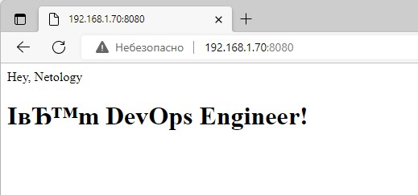

# devops-netology
### Желобанов Егор DEVOPS-21

# Домашнее задание к занятию "5.3. Введение. Экосистема. Архитектура. Жизненный цикл Docker контейнера".

### Задача 1.
* создайте свой репозиторий на https://hub.docker.com;
* выберете любой образ, который содержит веб-сервер Nginx;
* создайте свой fork образа;
* реализуйте функциональность: запуск веб-сервера в фоне с индекс-страницей, содержащей HTML-код ниже:
```html
<html>
<head>
Hey, Netology
</head>
<body>
<h1>I’m DevOps Engineer!</h1>
</body>
</html>
```
Опубликуйте созданный форк в своем репозитории и предоставьте ответ в виде ссылки на [https://hub.docker.com/username_repo](https://hub.docker.com/username_repo).
#### Ответ:
В качестве исходного образа взят образ Docker [nginx:latest](https://hub.docker.com/_/nginx).  
При сборке своего образа, в Docker файле я прописал команду копирования заранее подготовленного файла index.html с необходимым содержимым внутрь контейнера.  
Ссылки на файлы:
* [Dockerfile](Docker/5.3/Dockerfile)
* [index.html](Docker/5.3/index.html)

Запуск контейнера осуществил командой:   
```shell
egor@netology:~$ docker run -d -p 8080:80 egorz/nginx-netology:1.23.2
```
Зашел через браузер и увидел результат:  
  
  
 

Ссылка на репозиторий: [egorz/nginx-netology:1.23.2](https://hub.docker.com/repository/docker/egorz/nginx-netology)

### Задача 2.
Посмотрите на сценарий ниже и ответьте на вопрос: "Подходит ли в этом сценарии использование Docker контейнеров или лучше подойдет виртуальная машина, физическая машина? Может быть возможны разные варианты?"

Детально опишите и обоснуйте свой выбор.

--

Сценарий:
* Высоконагруженное монолитное java веб-приложение;
* Nodejs веб-приложение;
* Мобильное приложение c версиями для Android и iOS;
* Шина данных на базе Apache Kafka;
* Elasticsearch кластер для реализации логирования продуктивного веб-приложения - три ноды elasticsearch, два logstash и две ноды kibana;
* Мониторинг-стек на базе Prometheus и Grafana;
* MongoDB, как основное хранилище данных для java-приложения;
* Gitlab сервер для реализации CI/CD процессов и приватный (закрытый) Docker Registry.

#### Ответ:
* Высоконагруженное монолитное java веб-приложение. Т.к. приложение монолитное, предполагающее сборку всех компонентов в одном месте (фронтенд, бэкенд и т.п.), и к тому же высоконагруженное, то здесь подойдет физический сервер.
* Nodejs веб-приложение. В этом случае подойдет контейнеризация Docker, т.к. Nodejs не требует много ресурсов. Такой подход особенно следует выделить в рамках микросервисной архитектуры приложения.
* Мобильное приложение c версиями для Android и iOS. Полагаю что здесь лучше использовать вритупльную машину, т.к. приложение в Docker контейнере не имеет своего UI.
* Шина данных на базе Apache Kafka. понимаю, что данный сервис обеспечивает трансляцию из одного формата данных приложения в другое. Здесь можно использовать Docker, ввиду невысокой требовательности к ресурсам.
* Elasticsearch кластер для реализации логирования продуктивного веб-приложения - три ноды elasticsearch, два logstash и две ноды kibana. Здесь можно использовать комбинированное решение: например elasticsearch
располагается на виртуальных машинах с обеспечением отказоустойчивости с помощью кластеризации, а logstash и kibana - в Docker контейнерах, также в кластере. Хотя не вижу противопоказаний вообще все сервисы расположить в контейнерах Docker с обеспечением отказоустойчивости на уровне кластеров.
* Мониторинг-стек на базе Prometheus и Grafana. Для использования данных систем прекрасно подойдет Docker, т.к. его проще развернуть и масштабировать в дальнейшем для различных задач.
* MongoDB, как основное хранилище данных для java-приложения. Думаю что здесь лучше использовать виртуальную машину, т.к. это хранилище, а Docker контейнер не подходит для хранения данных. Если данное хранилище является высоконагруженным - то лучше использовать физический сервер.
* Gitlab сервер для реализации CI/CD процессов и приватный (закрытый) Docker Registry. В данном случае лучше использовать виртуальную машину или физический сервер. В данном случае, конечно, все зависит от предполагаемого объема информации для хранения.

