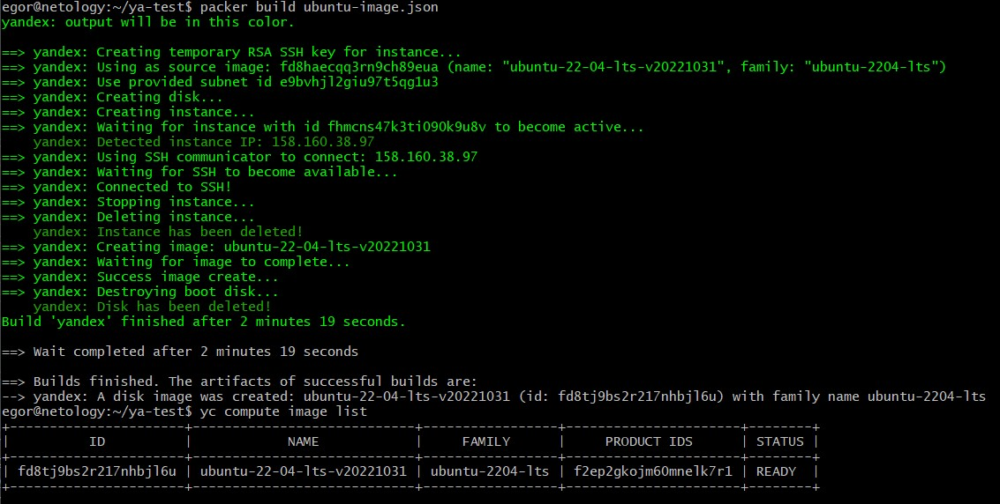
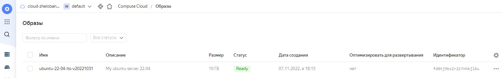
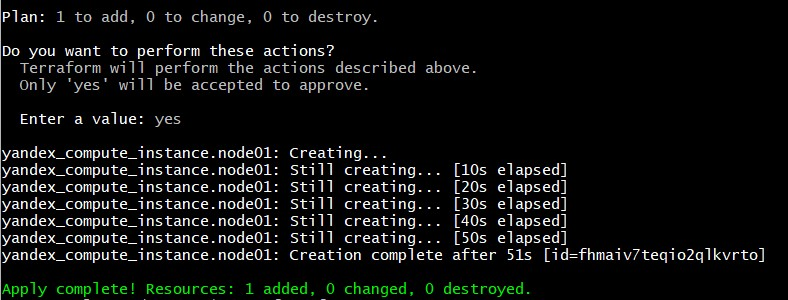
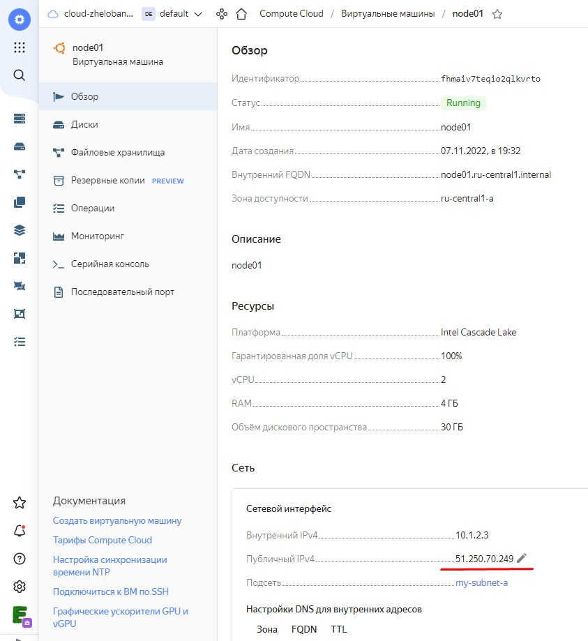
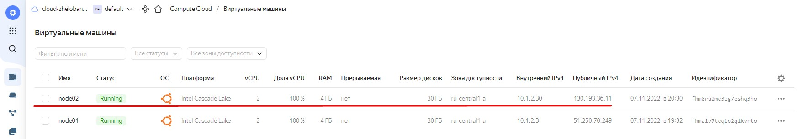
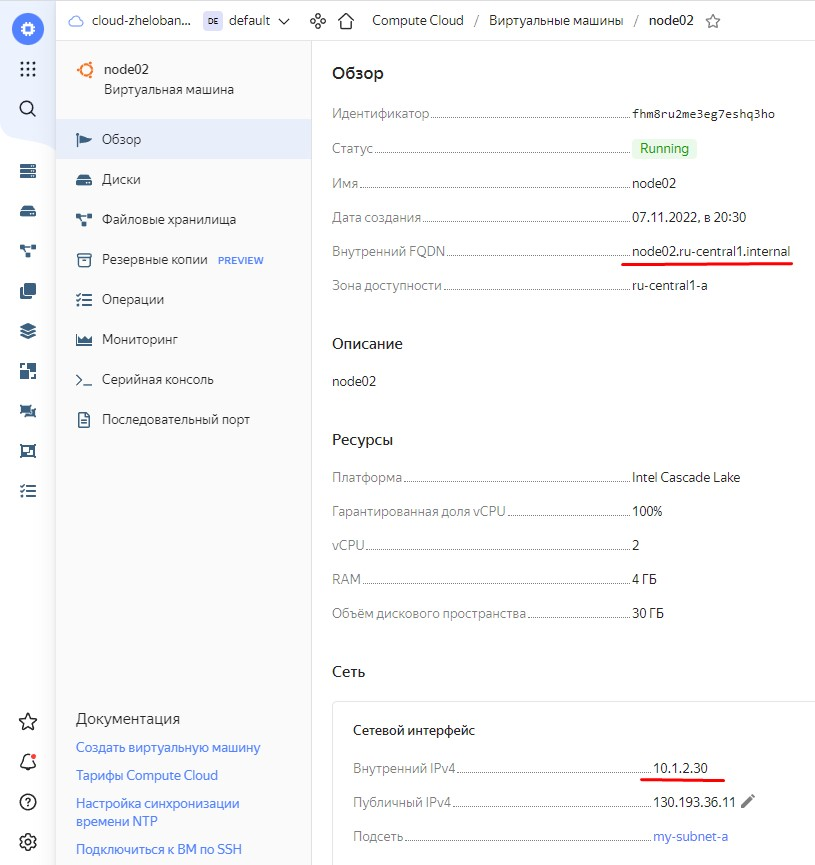
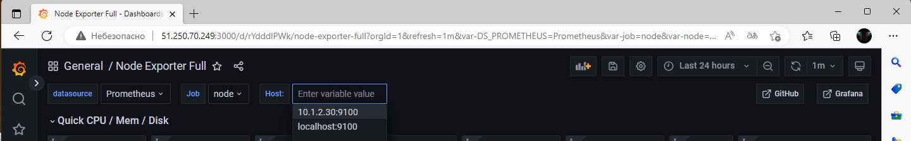
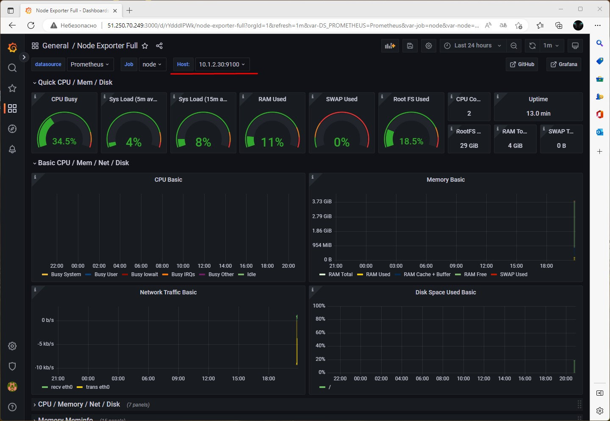

# devops-netology
### Желобанов Егор DEVOPS-21

# Домашнее задание к занятию "5.4. Оркестрация группой Docker контейнеров на примере Docker Compose".

### Задача 1.
Создать собственный образ операционной системы с помощью Packer.
#### Ответ:
Создал образ операционной системы на основе Ubuntu server 20.04:  
  

### Задача 2.
Создать вашу первую виртуальную машину в Яндекс.Облаке.
#### Ответ:
Создал виртуальную машину:  
  

### Задача 3.
Создать ваш первый готовый к боевой эксплуатации компонент мониторинга, состоящий из стека микросервисов.
#### Ответ:
Скриншот рабочей системы на node01 ниже:  

### Задача 4.
Создать вторую ВМ и подключить её к мониторингу развёрнутому на первом сервере.
#### Ответ:
Создана вторая ВМ node02 из того же образа на основе Ubuntu server 20.04:  
  
  
Сервер node02 подключен к prometheus сервера node01 по внутренней сети:  
  
Как видим, в grafana прекрасно отображаются метрики нового сервера node02:  
  
