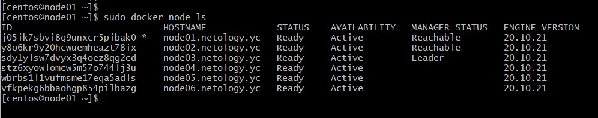
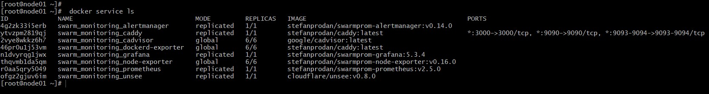
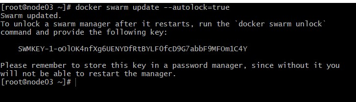
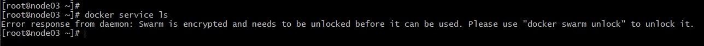
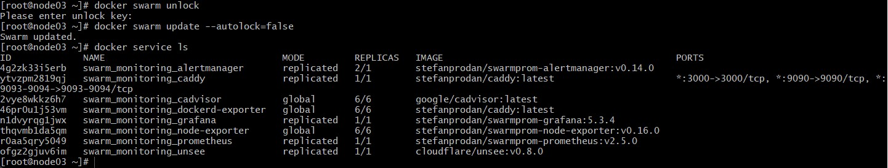

# devops-netology
### Желобанов Егор DEVOPS-21

# Домашнее задание к занятию "5.4. Оркестрация кластером Docker контейнеров на примере Docker Swarm".

### Задача 1.
Дайте письменые ответы на следующие вопросы:

- В чём отличие режимов работы сервисов в Docker Swarm кластере: replication и global?
- Какой алгоритм выбора лидера используется в Docker Swarm кластере?
- Что такое Overlay Network?

#### Ответ:
- `replication` - мы сами указываем, сколько идентичных задач (реплик) необходимо запустить, `global` - это сервис, который запускает одну задачу на каждой ноде.
- Используется так называемый алгоритм поддержания распределенного консенсуса — Raft. Своими словами - участвуют как минимум две ноды, отправляя заявку на лидерство, и кто первый ответил, тот становится лидером. Далее в процессе работы ноды периодически между собой посылают запросы, чтобы определить доступен ли лидер и отвечает ли он до сих пор первым, и в случае, если лидер не ответил в заданное время идет пере-согласование по тому же принципу. [Взял информацию здесь](http://thesecretlivesofdata.com/raft/).
- Overlay Network - распределенная сеть кластера, которая позволяет общаться контейнерам между собой на разных нодах, с возможностью шифрования трафика. Docker engine в рамках такой сети, сам занимается маршрутизацией.

### Задача 2
Создать ваш первый Docker Swarm кластер в Яндекс.Облаке.

#### Ответ:
Создал кластер в Яндекм.Облако:  

  

### Задача 3
Создать ваш первый, готовый к боевой эксплуатации кластер мониторинга, состоящий из стека микросервисов.

#### Ответ:
Кластер мониторинга:  

   

### Задача 4 (*)
Выполнить на лидере Docker Swarm кластера команду (указанную ниже) и дать письменное описание её функционала, что она делает и зачем она нужна:
```
# см.документацию: https://docs.docker.com/engine/swarm/swarm_manager_locking/
docker swarm update --autolock=true
```

#### Ответ:
Выполнил на лидере кластера команду `docker swarm update --autolock=true`:  

   

Логи по выбору лидера из менеджеров шифруются по умолчанию. Таким образом обеспечивается безопасность. Трафик между нодами, в том числе, шифруется по той же причине. Ключи шифрования логов и трафика, на момент рестарта Docker помещаются в память менеджеров. Вы становитесь владельцем заблокированных таким способом ключей и необходима ручная разблокировка менеджеров, после рестарта Docker. Разблокировка происходит тем ключом, который генерировался на момент блока.  

После рестарта Docker:   

   

Разблокировку можно выполнить командой `docker swarm unlock`, и введя ключ, сгенерированный ранее:  

   

А также отключить автоматическую блокировку командой `docker swarm update --autolock=false`.
