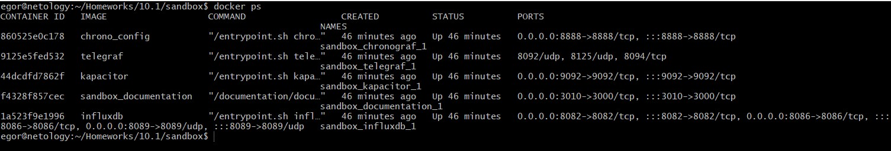
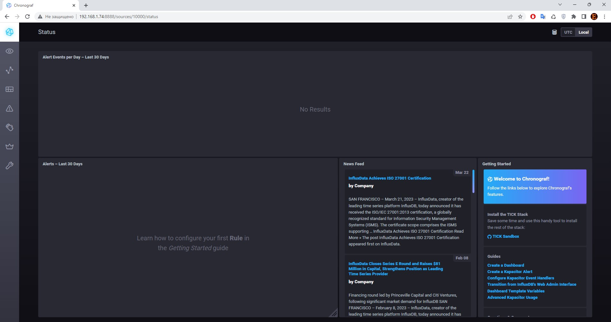
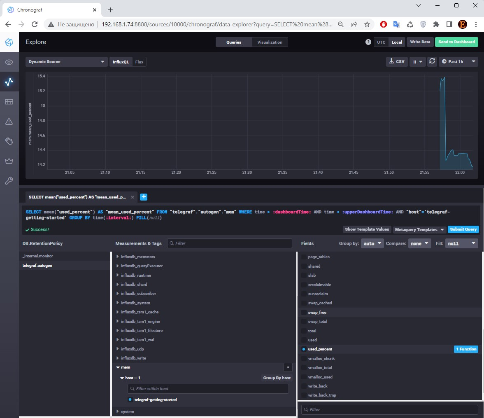
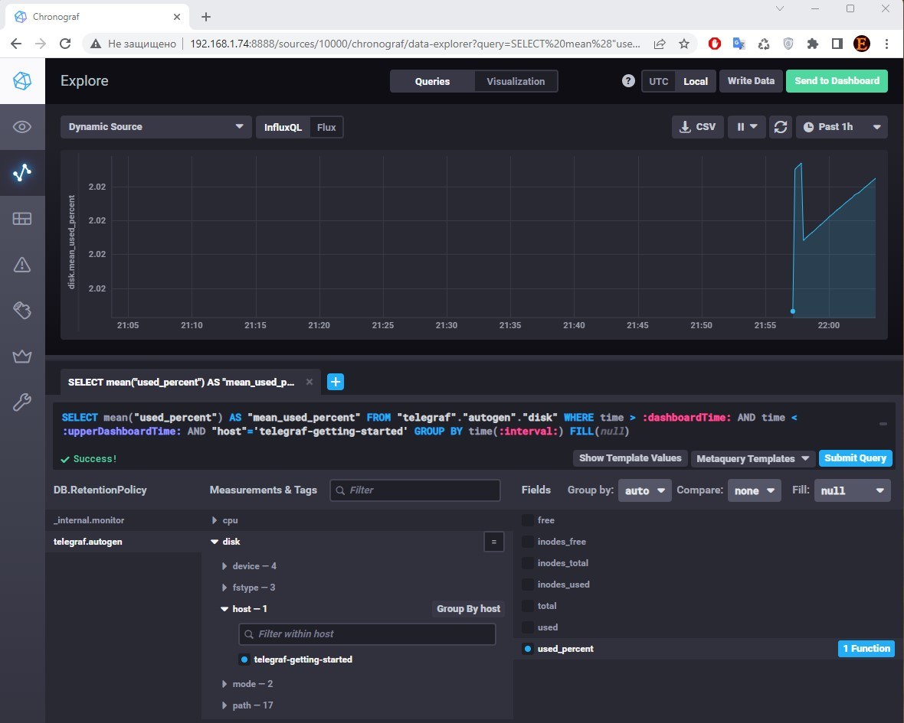
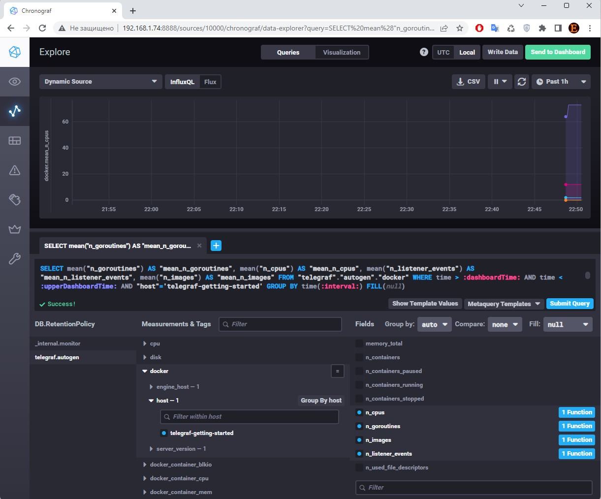
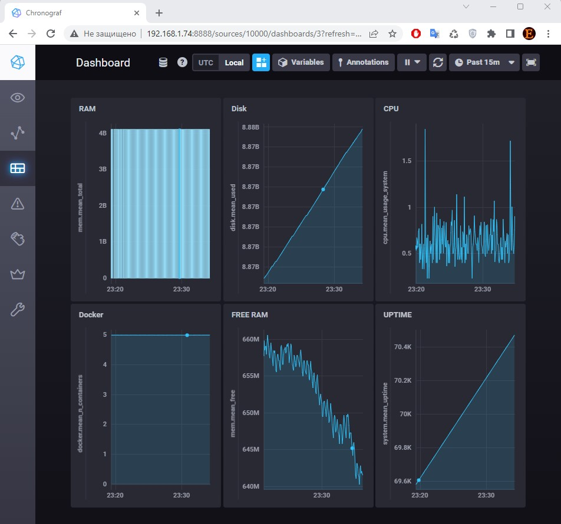

# devops-netology
### Желобанов Егор DEVOPS-21

# Домашнее задание к занятию "10.1 Введение в мониторинг"

## Обязательные задания

1. Вас пригласили настроить мониторинг на проект. На онбординге вам рассказали, что проект представляет из себя 
платформу для вычислений с выдачей текстовых отчетов, которые сохраняются на диск. Взаимодействие с платформой 
осуществляется по протоколу http. Также вам отметили, что вычисления загружают ЦПУ. Какой минимальный набор метрик вы
выведите в мониторинг и почему?

### Ответ:
По данному вопросу я бы подобрал следующий минимальный набор метрик:
* Утилизация CPU/RAM. Набор этих метрик поможет выявить узкое место при выполнении вычислений и покажет пиковые нагрузки.
* Несколько метрик HDD, помогут выявить проблемы с жесткими дисками системы:
    * объем свободного пространства;
    * операций в секунду на запись/чтение;
    * inodes по каждому разделу.
* Метрики сетевых интерфейсов. Анализируем количество трафика (входящий/исходящий), поможет выявить нагрузку на сетевые интерфейсы.
* Метрики взаимодействия http:
  * наличие и количество ошибок по типам 4хх/5хх;
  * время отклика сервиса на запросы;
  * количество положительных ответов (2хх/3хх) на запросы в процентном выражении.

2. Менеджер продукта посмотрев на ваши метрики сказал, что ему непонятно что такое RAM/inodes/CPUla. Также он сказал, 
что хочет понимать, насколько мы выполняем свои обязанности перед клиентами и какое качество обслуживания. Что вы 
можете ему предложить?

### Ответ:
По данному вопросу можно предложить разработать SLA (соглашение об уровне обслуживания), включить в него SLO (целевой уровень)
качества обслуживания), которые можно рассчитать при помощи SLI (индикаторов качества обслуживания):
* С помощью полученных метрик CPU/RAM/inodes можно показать общее состояние системы и ее загрузку.
* С помощью метрик http можно показать время доступности системы, количество ошибок по типам 4хх/5хх, также показать количество ошибок/положительных ответов сервисов в процентном выражении.
* Общая доступность сервиса и доля безошибочных ответов.

3. Вашей DevOps команде в этом году не выделили финансирование на построение системы сбора логов. Разработчики в свою 
очередь хотят видеть все ошибки, которые выдают их приложения. Какое решение вы можете предпринять в этой ситуации, 
чтобы разработчики получали ошибки приложения?

### Ответ:
В данном случае могу предложить несколько вариантов решений:
* Написать скрипт сбора ошибок из текстовых логов с возможностью отправки по e-mail отделу разработки.
* Использовать open source решения для сборки логов и централизованного их хранения (Logstash, Graylog и.т.п).
* Организовать сбор метрик в разрезе определенного типа ошибок по отдельным методам сервиса, позволит определить время и тип ошибки.

4. Вы, как опытный SRE, сделали мониторинг, куда вывели отображения выполнения SLA=99% по http кодам ответов. 
Вычисляете этот параметр по следующей формуле: `summ_2xx_requests/summ_all_requests`. Данный параметр не поднимается выше 
70%, но при этом в вашей системе нет кодов ответа 5xx и 4xx. Где у вас ошибка?

### Ответ:
Для корректной работы необходимо учитывать все коды ответов, а в нашем случае не учитываются 1хх и 3хх коды ответов.
Полагаю что правильная формула должна быть такой: `(summ_1xx_requests + summ_2xx_requests + summ_3xx_requests)/summ_all_requests`.

5. Опишите основные плюсы и минусы pull и push систем мониторинга.
### Ответ:
* Pull-модель системы мониторинга:
    * Плюсы:
        - единая точка конфигурирования, которой является сервер мониторинга;
        - проще контролировать подлинность данных - опрос агентов, которые настроены в системе мониторинга;
        - возможность настроить единый proxy-server до всех агентов с TLS;
        - возможен мониторинг без агентов, например по протоколу SNMP;
        - более простая отладка получения данных с агентов посредством http.
    * Минусы:
        - http является более затратным способом передачи по сравнению с UDP;
        - узкое место - точка отказа, которой является сам сервер мониторинга;
        - Повышенная нагрузка на базу данных со стороны системы мониторинга, т.к. инициатором запросов метрик является сама система мониторинга;
        - Менее гибкая настройка отправки пакетов данных с метриками, т.к. при необходимости добавления индивидуальной частоты опроса придется создавать новый элемент данных и шаблон для каждого узла.
* Push-модель системы мониторинга:
    * Плюсы:
        - опрос узлов по протоколу UDP, что является менее затратным по сравнению с http, в связи с чем производительность системы мониторинга возрастет;
        - точка отправки или набор таких точек настраивается на стороне клиента;
        - база данных выполняет свою основную задачу – хранение метрик и управление их жизненным циклом, пассивно ожидая записи новых данных.
        - упрощение репликации данных в разные системы мониторинга или создание их резервных копий;
        - более гибкая настройка отправки пакетов данных с метриками - на каждом клиенте задается объем данных и частота отправки.
    * Минусы:
        - отсутсвие гарантии доставки при использовании UDP, т.к. в отличие от TCP он обеспечивает передачу данных без получения подтверждения;
        - возможна потеря информации/метрик при недоступности агента;
        - необходимость настройки агента на каждом хосте;
        - могут возникнуть сложности взаимодействия агентов через единый прокси, а также сложности со сбором логов с агентов.

6. Какие из ниже перечисленных систем относятся к push модели, а какие к pull? А может есть гибридные?

    - Prometheus 
    - TICK
    - Zabbix
    - VictoriaMetrics
    - Nagios
### Ответ:
- Prometheus - Pull.
- TICK - Push.
- Zabbix - гибридная (Push/Pull).
- VictoriaMetrics - гибридная (Push/Pull).
- Nagios - Pull.

7. Склонируйте себе [репозиторий](https://github.com/influxdata/sandbox/tree/master) и запустите TICK-стэк, 
используя технологии docker и docker-compose.

В виде решения на это упражнение приведите выводы команд с вашего компьютера (виртуальной машины):

    - curl http://localhost:8086/ping
    - curl http://localhost:8888
    - curl http://localhost:9092/kapacitor/v1/ping

А также скриншот веб-интерфейса ПО chronograf (`http://localhost:8888`). 

P.S.: если при запуске некоторые контейнеры будут падать с ошибкой - проставьте им режим `Z`, например
`./data:/var/lib:Z`
### Ответ:
Поднял TICK-стэк, выполнил команды. Первая и последняя команды не вернули никакого результата:
```shell
egor@netology:~/Homeworks/10.1/sandbox$ curl http://localhost:8086/ping
egor@netology:~/Homeworks/10.1/sandbox$
egor@netology:~/Homeworks/10.1/sandbox$ curl http://localhost:8888
<!DOCTYPE html><html><head><link rel="stylesheet" href="/index.c708214f.css"><meta http-equiv="Content-type" content="text/html; charset=utf-8"><title>Chronograf</title><link rel="icon shortcut" href="/favicon.70d63073.ico"></head><body> <div id="react-root" data-basepath=""></div> <script type="module" src="/index.c5ba09e6.js"></script><script src="/index.59cbcbd2.js" nomodule="" defer></script> </body></html>egor@netology:~/Homeworks/10.1/sandbox$
egor@netology:~/Homeworks/10.1/sandbox$ curl http://localhost:9092/kapacitor/v1/ping
egor@netology:~/Homeworks/10.1/sandbox$

```
Проверил, контейнеры работают, прилагаю скриншот:  
  

Т.к. действия выполняю на виртуальной машине с адресом 192.168.1.74, соответственно в браузере ввожу `http://192.168.1.74:8888`, вижу веб-интерфейс Cronograf:
  

8. Перейдите в веб-интерфейс Chronograf (`http://localhost:8888`) и откройте вкладку `Data explorer`.

    - Нажмите на кнопку `Add a query`
    - Изучите вывод интерфейса и выберите БД `telegraf.autogen`
    - В `measurments` выберите mem->host->telegraf_container_id , а в `fields` выберите used_percent. 
    Внизу появится график утилизации оперативной памяти в контейнере telegraf.
    - Вверху вы можете увидеть запрос, аналогичный SQL-синтаксису. 
    Поэкспериментируйте с запросом, попробуйте изменить группировку и интервал наблюдений.

Для выполнения задания приведите скриншот с отображением метрик утилизации места на диске 
(disk->host->telegraf_container_id) из веб-интерфейса.
### Ответ:
Для выполнения данного пункта предварительно в `telegraf.conf` добавил inputs по диску и памяти:
```shell
[[inputs.mem]]
[[inputs.disk]]
```  
Метрики памяти:  
  

Метрики по диску:  
  

9. Изучите список [telegraf inputs](https://github.com/influxdata/telegraf/tree/master/plugins/inputs). 
Добавьте в конфигурацию telegraf следующий плагин - [docker](https://github.com/influxdata/telegraf/tree/master/plugins/inputs/docker):
```
[[inputs.docker]]
  endpoint = "unix:///var/run/docker.sock"
```

Дополнительно вам может потребоваться донастройка контейнера telegraf в `docker-compose.yml` дополнительного volume и 
режима privileged:
```
  telegraf:
    image: telegraf:1.4.0
    privileged: true
    volumes:
      - ./etc/telegraf.conf:/etc/telegraf/telegraf.conf:Z
      - /var/run/docker.sock:/var/run/docker.sock:Z
    links:
      - influxdb
    ports:
      - "8092:8092/udp"
      - "8094:8094"
      - "8125:8125/udp"
```

После настройке перезапустите telegraf, обновите веб интерфейс и приведите скриншотом список `measurments` в 
веб-интерфейсе базы telegraf.autogen . Там должны появиться метрики, связанные с docker.

Факультативно можете изучить какие метрики собирает telegraf после выполнения данного задания.

### Ответ:
Метрики связанные с docker появились только после добавления пользователя, владеющего сокетом:
```shell
telegraf@e2c629ef3fdc:/$ stat -c '%g' /var/run/docker.sock
998
```  
Добавил в файл `docker-compose.yml`:
```yaml
telegraf:
    # Full tag list: https://hub.docker.com/r/library/telegraf/tags/
    user: telegraf:998
```  
После перезапуска sandbox, метрики появились:  
  

## Дополнительное задание (со звездочкой*) - необязательно к выполнению

1. Вы устроились на работу в стартап. На данный момент у вас нет возможности развернуть полноценную систему 
мониторинга, и вы решили самостоятельно написать простой python3-скрипт для сбора основных метрик сервера. Вы, как 
опытный системный-администратор, знаете, что системная информация сервера лежит в директории `/proc`. 
Также, вы знаете, что в системе Linux есть  планировщик задач cron, который может запускать задачи по расписанию.

Суммировав все, вы спроектировали приложение, которое:
- является python3 скриптом
- собирает метрики из папки `/proc`
- складывает метрики в файл 'YY-MM-DD-awesome-monitoring.log' в директорию /var/log 
(YY - год, MM - месяц, DD - день)
- каждый сбор метрик складывается в виде json-строки, в виде:
  + timestamp (временная метка, int, unixtimestamp)
  + metric_1 (метрика 1)
  + metric_2 (метрика 2)
  
     ...
     
  + metric_N (метрика N)
  
- сбор метрик происходит каждую 1 минуту по cron-расписанию

Для успешного выполнения задания нужно привести:

а) работающий код python3-скрипта,

б) конфигурацию cron-расписания,

в) пример верно сформированного 'YY-MM-DD-awesome-monitoring.log', имеющий не менее 5 записей,

P.S.: количество собираемых метрик должно быть не менее 4-х.
P.P.S.: по желанию можно себя не ограничивать только сбором метрик из `/proc`.

### Ответ:
* [Python3-скрипт](../practice/10.1/metrics.py) для сбора основных метрик.
* [Конфигурация](../practice/10.1/cron_metric) планировщика cron.
* Пример сформированного [лог-файла](../practice/10.1/2023-03-22-awesome-monitoring.log).

2. В веб-интерфейсе откройте вкладку `Dashboards`. Попробуйте создать свой dashboard с отображением:

    - утилизации ЦПУ
    - количества использованного RAM
    - утилизации пространства на дисках
    - количество поднятых контейнеров
    - аптайм
    - ...
    - фантазируйте)

### Ответ:

