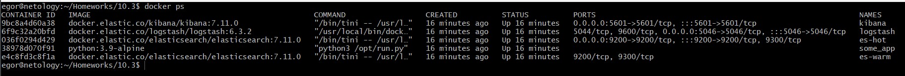
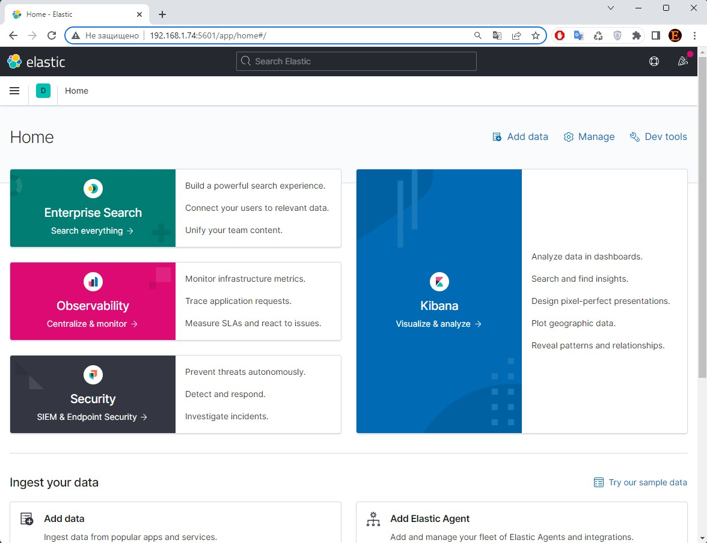
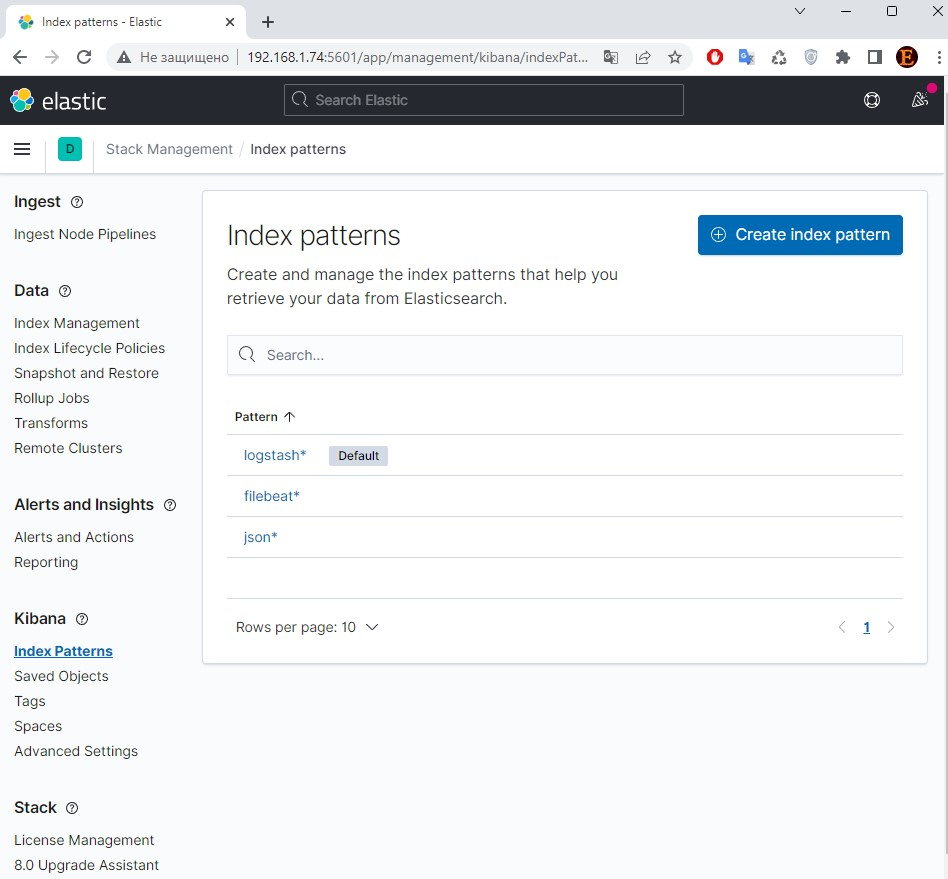
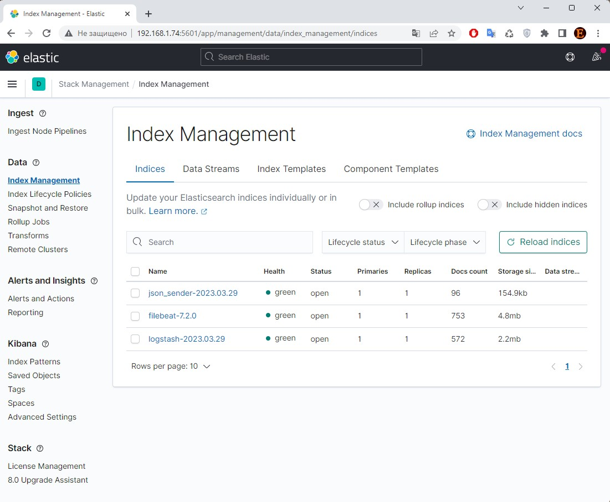

# devops-netology
### Желобанов Егор DEVOPS-21

# Домашнее задание к занятию 10.3 «Система сбора логов Elastic Stack»

## Дополнительные ссылки

При выполнении задания используйте дополнительные ресурсы:

- [поднимаем elk в docker](https://www.elastic.co/guide/en/elastic-stack-get-started/current/get-started-docker.html);
- [поднимаем elk в docker с filebeat и docker-логами](https://www.sarulabs.com/post/5/2019-08-12/sending-docker-logs-to-elasticsearch-and-kibana-with-filebeat.html);
- [конфигурируем logstash](https://www.elastic.co/guide/en/logstash/current/configuration.html);
- [плагины filter для logstash](https://www.elastic.co/guide/en/logstash/current/filter-plugins.html);
- [конфигурируем filebeat](https://www.elastic.co/guide/en/beats/libbeat/5.3/config-file-format.html);
- [привязываем индексы из elastic в kibana](https://www.elastic.co/guide/en/kibana/current/index-patterns.html);
- [как просматривать логи в kibana](https://www.elastic.co/guide/en/kibana/current/discover.html);
- [решение ошибки increase vm.max_map_count elasticsearch](https://stackoverflow.com/questions/42889241/how-to-increase-vm-max-map-count).

В процессе выполнения в зависимости от системы могут также возникнуть не указанные здесь проблемы.

Используйте output stdout filebeat/kibana и api elasticsearch для изучения корня проблемы и её устранения.

## Задание повышенной сложности

Не используйте директорию [help](../practice/10.3/help) при выполнении домашнего задания.

## Задание 1

Вам необходимо поднять в докере и связать между собой:

- elasticsearch (hot и warm ноды);
- logstash;
- kibana;
- filebeat.

Logstash следует сконфигурировать для приёма по tcp json-сообщений.

Filebeat следует сконфигурировать для отправки логов docker вашей системы в logstash.

В директории [help](../practice/10.3/help) находится манифест docker-compose и конфигурации filebeat/logstash для быстрого 
выполнения этого задания.

Результатом выполнения задания должны быть:

- скриншот `docker ps` через 5 минут после старта всех контейнеров (их должно быть 5);
- скриншот интерфейса kibana;
- docker-compose манифест (если вы не использовали директорию help);
- ваши yml-конфигурации для стека (если вы не использовали директорию help).

### Ответ:
Задание выполняю с помощью docker-compose из директории [help](../practice/10.3/help) на виртуальной машине с адресом `192.168.1.74`.  
После старта, примерно через 40 секунд падали два контейнера `es-hot` и `es-warm`. Запустив поочередно команды `docker-compose logs es-warm` и `docker-compose logs es-hot`, обнаружил в логах сообщения:  
```shell
[1]: max virtual memory areas vm.max_map_count [65530] is too low, increase to at least [262144]
```
Ответ на вопрос нашел [здесь](https://www.elastic.co/guide/en/elasticsearch/reference/current/vm-max-map-count.html), выполнил команду `sudo sysctl -w vm.max_map_count=262144`, поднял контейнеры заново, все работает:  

  

Прошел по адресу http://192.168.1.74:5601, проверил что Elastic доступен:  

  

---
## Задание 2

Перейдите в меню [создания index-patterns  в kibana](http://localhost:5601/app/management/kibana/indexPatterns/create) и создайте несколько index-patterns из имеющихся.

Перейдите в меню просмотра логов в kibana (Discover) и самостоятельно изучите, как отображаются логи и как производить поиск по логам.

В манифесте директории help также приведенно dummy-приложение, которое генерирует рандомные события в stdout-контейнера.
Эти логи должны порождать индекс logstash-* в elasticsearch. Если этого индекса нет — воспользуйтесь советами и источниками из раздела «Дополнительные ссылки» этого задания.

### Ответ:
Создал несколько index-patterns:  


Также видим индексы logstash:  
  
