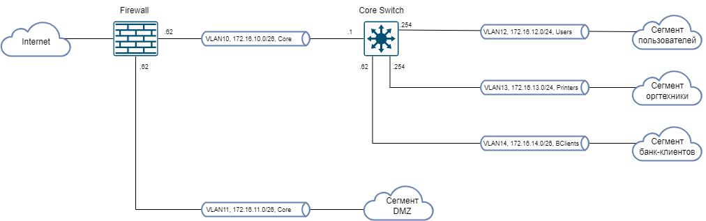

# devops-netology

## HomeWork 3.8
### Желобанов Егор DEVOPS-21

1. Подключился с помощью `telnet` к `route-views.routeviews.org`. Предварительно командой `dig +short myip.opendns.com @resolver1.opendns.com` определил свой публичный ip - 89.113.101.205 (т.к. выполняю задание через мобильный интернет, IP меняется). Далее выполняем команды:
    * `show ip route 89.113.101.205`:
   ```shell
    route-views>show ip route 89.113.101.205
    Routing entry for 89.113.101.0/24
      Known via "bgp 6447", distance 20, metric 0
      Tag 2497, type external
      Last update from 202.232.0.2 7w0d ago
      Routing Descriptor Blocks:
      * 202.232.0.2, from 202.232.0.2, 7w0d ago
          Route metric is 0, traffic share count is 1
          AS Hops 3
          Route tag 2497
          MPLS label: none
    ```
    * `show bgp 89.113.101.205`:
   ```shell
    route-views>show bgp 89.113.101.205
    BGP routing table entry for 89.113.101.0/24, version 307615501
    Paths: (22 available, best #21, table default)
      Not advertised to any peer
      Refresh Epoch 1
      20130 6939 3216 16345
        140.192.8.16 from 140.192.8.16 (140.192.8.16)
          Origin IGP, localpref 100, valid, external
          path 7FE18A705988 RPKI State not found
          rx pathid: 0, tx pathid: 0
      Refresh Epoch 1
      20912 3257 3356 3216 3216 16345
        212.66.96.126 from 212.66.96.126 (212.66.96.126)
          Origin IGP, localpref 100, valid, external
          Community: 3257:8070 3257:30515 3257:50001 3257:53900 3257:53902 20912:65004
          path 7FE158A416C0 RPKI State not found
          rx pathid: 0, tx pathid: 0
      Refresh Epoch 1
      49788 12552 3216 16345
        91.218.184.60 from 91.218.184.60 (91.218.184.60)
          Origin IGP, localpref 100, valid, external
          Community: 12552:12000 12552:12100 12552:12101 12552:22000
          Extended Community: 0x43:100:1
          path 7FE0BF9B1FF0 RPKI State not found
          rx pathid: 0, tx pathid: 0
      Refresh Epoch 1
      3333 1103 3216 16345
        193.0.0.56 from 193.0.0.56 (193.0.0.56)
          Origin IGP, localpref 100, valid, external
          Community: 3216:2001 3216:4427 65000:52254 65000:65049
          path 7FE0E9A1A4D0 RPKI State not found
          rx pathid: 0, tx pathid: 0
      Refresh Epoch 1
      53767 14315 6453 6762 3216 16345
        162.251.163.2 from 162.251.163.2 (162.251.162.3)
          Origin IGP, localpref 100, valid, external
          Community: 14315:5000 53767:5000
          path 7FE10170A3B8 RPKI State not found
          rx pathid: 0, tx pathid: 0
      Refresh Epoch 1
      7660 2516 6762 3216 16345
        203.181.248.168 from 203.181.248.168 (203.181.248.168)
          Origin IGP, localpref 100, valid, external
          Community: 2516:1030 7660:9003
          path 7FE00F8607A0 RPKI State not found
          rx pathid: 0, tx pathid: 0
      Refresh Epoch 1
      101 3356 3216 3216 16345
        209.124.176.223 from 209.124.176.223 (209.124.176.223)
          Origin IGP, localpref 100, valid, external
          Community: 101:20100 101:20110 101:22100 3216:2001 3216:4427 3356:2 3356:22 3356:100 3356:123 3356:501 3356:903 3356:2065
          Extended Community: RT:101:22100
          path 7FE129F04B98 RPKI State not found
          rx pathid: 0, tx pathid: 0
      Refresh Epoch 1
      3561 3910 3356 3216 3216 16345
        206.24.210.80 from 206.24.210.80 (206.24.210.80)
          Origin IGP, localpref 100, valid, external
          path 7FE0ABAD9DF8 RPKI State not found
          rx pathid: 0, tx pathid: 0
      Refresh Epoch 1
      8283 3216 16345
        94.142.247.3 from 94.142.247.3 (94.142.247.3)
          Origin IGP, metric 0, localpref 100, valid, external
          Community: 3216:2001 3216:4427 8283:1 8283:101 65000:52254 65000:65049
          unknown transitive attribute: flag 0xE0 type 0x20 length 0x18
            value 0000 205B 0000 0000 0000 0001 0000 205B
                  0000 0005 0000 0001
          path 7FE042C42A58 RPKI State not found
          rx pathid: 0, tx pathid: 0
      Refresh Epoch 1
      3267 3216 16345
        194.85.40.15 from 194.85.40.15 (185.141.126.1)
          Origin IGP, metric 0, localpref 100, valid, external
          path 7FE0A57FB408 RPKI State not found
          rx pathid: 0, tx pathid: 0
      Refresh Epoch 1
      4901 6079 3356 3216 3216 16345
        162.250.137.254 from 162.250.137.254 (162.250.137.254)
          Origin IGP, localpref 100, valid, external
          Community: 65000:10100 65000:10300 65000:10400
          path 7FE125D314B0 RPKI State not found
          rx pathid: 0, tx pathid: 0
      Refresh Epoch 1
      701 1273 3216 3216 16345
        137.39.3.55 from 137.39.3.55 (137.39.3.55)
          Origin IGP, localpref 100, valid, external
          path 7FE142DD38D0 RPKI State not found
          rx pathid: 0, tx pathid: 0
      Refresh Epoch 1
      3356 3216 3216 16345
        4.68.4.46 from 4.68.4.46 (4.69.184.201)
          Origin IGP, metric 0, localpref 100, valid, external
          Community: 3216:2001 3216:4427 3356:2 3356:22 3356:100 3356:123 3356:501 3356:903 3356:2065
          path 7FE09CFA2B80 RPKI State not found
          rx pathid: 0, tx pathid: 0
      Refresh Epoch 1
      57866 9002 3216 16345
        37.139.139.17 from 37.139.139.17 (37.139.139.17)
          Origin IGP, metric 0, localpref 100, valid, external
          Community: 9002:9002 9002:64615
          path 7FE0EACDC580 RPKI State not found
          rx pathid: 0, tx pathid: 0
      Refresh Epoch 1
      1351 6939 3216 16345
        132.198.255.253 from 132.198.255.253 (132.198.255.253)
          Origin IGP, localpref 100, valid, external
          path 7FE011F505E8 RPKI State not found
          rx pathid: 0, tx pathid: 0
      Refresh Epoch 1
      7018 6762 3216 16345
        12.0.1.63 from 12.0.1.63 (12.0.1.63)
          Origin IGP, localpref 100, valid, external
          Community: 7018:5000 7018:37232
          path 7FE0A0825F58 RPKI State not found
          rx pathid: 0, tx pathid: 0
      Refresh Epoch 1
      852 3356 3216 3216 16345
        154.11.12.212 from 154.11.12.212 (96.1.209.43)
          Origin IGP, metric 0, localpref 100, valid, external
          path 7FE029847FF0 RPKI State not found
          rx pathid: 0, tx pathid: 0
      Refresh Epoch 1
      3549 3356 3216 3216 16345
        208.51.134.254 from 208.51.134.254 (67.16.168.191)
          Origin IGP, metric 0, localpref 100, valid, external
          Community: 3216:2001 3216:4427 3356:2 3356:22 3356:100 3356:123 3356:501 3356:903 3356:2065 3549:2581 3549:30840
          path 7FE147AA8550 RPKI State not found
          rx pathid: 0, tx pathid: 0
      Refresh Epoch 1
      6939 3216 16345
        64.71.137.241 from 64.71.137.241 (216.218.252.164)
          Origin IGP, localpref 100, valid, external
          path 7FE12352ADC0 RPKI State not found
          rx pathid: 0, tx pathid: 0
      Refresh Epoch 1
      3303 6762 3216 16345
        217.192.89.50 from 217.192.89.50 (138.187.128.158)
          Origin IGP, localpref 100, valid, external
          Community: 3303:1004 3303:1006 3303:1030 3303:3055 6762:1 6762:92 6762:14600
          path 7FE16DEEE428 RPKI State not found
          rx pathid: 0, tx pathid: 0
      Refresh Epoch 3
      2497 3216 16345
        202.232.0.2 from 202.232.0.2 (58.138.96.254)
          Origin IGP, localpref 100, valid, external, best
          path 7FE03A6C26B0 RPKI State not found
          rx pathid: 0, tx pathid: 0x0
      Refresh Epoch 1
      3257 3356 3216 3216 16345
        89.149.178.10 from 89.149.178.10 (213.200.83.26)
          Origin IGP, metric 10, localpref 100, valid, external
          Community: 3257:8794 3257:30043 3257:50001 3257:54900 3257:54901
          path 7FE0E3240028 RPKI State not found
          rx pathid: 0, tx pathid: 0
    ```
2. Создал dummy0 интерфейс:
   ```shell
   vagrant@vagrant:~$ sudo ip link add dummy0 type dummy
   vagrant@vagrant:~$ sudo ip addr add 10.0.3.15/24 dev dummy0
   vagrant@vagrant:~$ sudo ip link set dummy0 up
   vagrant@vagrant:~$ ip addr
   1: lo: <LOOPBACK,UP,LOWER_UP> mtu 65536 qdisc noqueue state UNKNOWN group default qlen 1000
      link/loopback 00:00:00:00:00:00 brd 00:00:00:00:00:00
      inet 127.0.0.1/8 scope host lo
        valid_lft forever preferred_lft forever
      inet6 ::1/128 scope host
        valid_lft forever preferred_lft forever
   2: eth0: <BROADCAST,MULTICAST,UP,LOWER_UP> mtu 1500 qdisc fq_codel state UP group default qlen 1000
      link/ether 08:00:27:a2:6b:fd brd ff:ff:ff:ff:ff:ff
      inet 10.0.2.15/24 brd 10.0.2.255 scope global dynamic eth0
        valid_lft 82875sec preferred_lft 82875sec
      inet6 fe80::a00:27ff:fea2:6bfd/64 scope link
        valid_lft forever preferred_lft forever
   3: dummy0: <BROADCAST,NOARP,UP,LOWER_UP> mtu 1500 qdisc noqueue state UNKNOWN group default qlen 1000
      link/ether 92:06:26:e4:9e:98 brd ff:ff:ff:ff:ff:ff
      inet 10.0.3.15/24 scope global dummy0
        valid_lft forever preferred_lft forever
      inet6 fe80::9006:26ff:fee4:9e98/64 scope link
        valid_lft forever preferred_lft forever
   ```  
   Добавляю статические маршруты:
   ```shell
   vagrant@vagrant:~$ sudo ip route add 8.8.8.0/24 via 10.0.2.1
   vagrant@vagrant:~$ sudo ip route add 8.12.64.0/24 via 10.0.3.15
   vagrant@vagrant:~$ sudo ip route add 8.10.24.0/24 via 10.0.3.15
   ```  
   Проверяем таблицу маршрутизации:
   ```shell
   vagrant@vagrant:~$ ip route
   default via 10.0.2.2 dev eth0 proto dhcp src 10.0.2.15 metric 100
   8.8.8.0/24 via 10.0.2.1 dev eth0
   8.10.24.0/24 via 10.0.3.15 dev dummy0
   8.12.64.0/24 via 10.0.3.15 dev dummy0
   10.0.2.0/24 dev eth0 proto kernel scope link src 10.0.2.15
   10.0.2.2 dev eth0 proto dhcp scope link src 10.0.2.15 metric 100
   10.0.3.0/24 dev dummy0 proto kernel scope link src 10.0.3.15
   ```
3. Проверяем открытые TCP порты:
   ```shell
   vagrant@vagrant:~$ sudo ss -tpan
   State     Recv-Q     Send-Q         Local Address:Port         Peer Address:Port     Process
   LISTEN    0          4096           127.0.0.53%lo:53                0.0.0.0:*         users:(("systemd-resolve",pid=614,fd=13))
   LISTEN    0          128                  0.0.0.0:22                0.0.0.0:*         users:(("sshd",pid=702,fd=3))
   ESTAB     0          0                  10.0.2.15:22               10.0.2.2:49376     users:(("sshd",pid=7933,fd=4),("sshd",pid=7893,fd=4))
   ESTAB     0          0                  10.0.2.15:22               10.0.2.2:62349     users:(("sshd",pid=7623,fd=4),("sshd",pid=7583,fd=4))
   LISTEN    0          128                     [::]:22                   [::]:*         users:(("sshd",pid=702,fd=4))
   ```  
   Видим, что 22 порт используется процессом `sshd` - соединение SSH.  
4. Проверяем используемые UDP сокеты:
   ```shell
   vagrant@vagrant:~$ sudo ss -upan
   State       Recv-Q      Send-Q            Local Address:Port            Peer Address:Port      Process
   UNCONN      0           0                 127.0.0.53%lo:53                   0.0.0.0:*          users:(("systemd-resolve",pid=614,fd=12))
   UNCONN      0           0                10.0.2.15%eth0:68                   0.0.0.0:*          users:(("systemd-network",pid=612,fd=19))
   ```
   И видим что на данный момент в системе нет используемых UDP сокетов.
5. Создал диаграмму небольшой сети в десктопном приложении `Draw.io`:  
   
   Также диаграмму можно [скачать для приложения draw.io](../schemas/L3_schema.drawio).
