# devops-netology

## HomeWork 3.9
### Желобанов Егор DEVOPS-21

Для выполнения заданий с 3 по 6, на VirtualBox были развернуты 2 сервера Ubuntu 20.04 LTS: `ubuntu1` - установка все по умолчанию, и `ubuntu2` - по умолчанию, OpenSSH server не установлен.

1. Установил Bitwarden плагин для браузера. Зарегистрировался и сохранил несколько паролей:  
    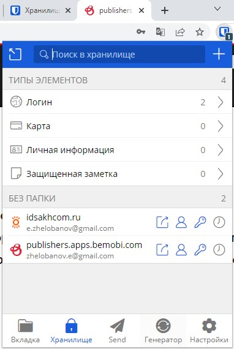
2. Установил Google authenticator на мобильный телефон. Настроил вход в Bitwarden акаунт через Google authenticator OTP:  
    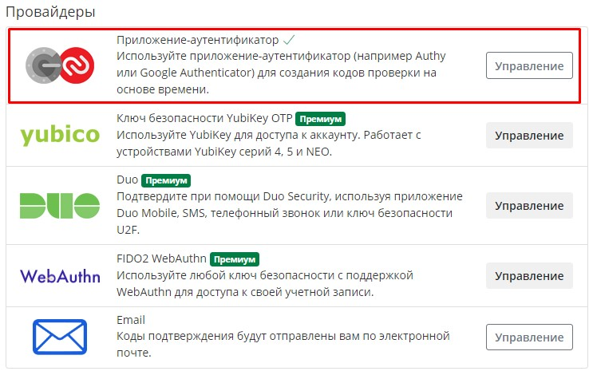  
    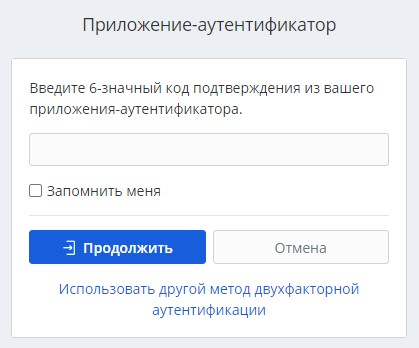
3. Установил apache2:  
    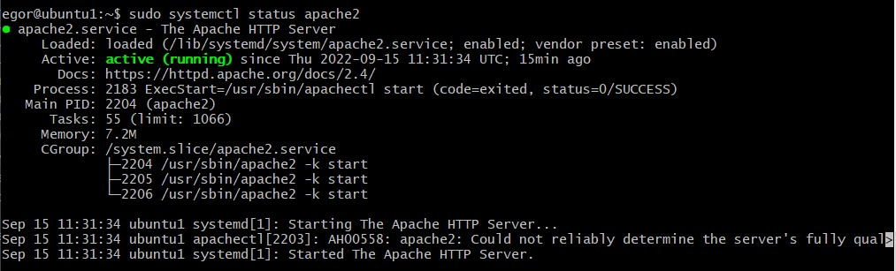  
    * сгенерировал сертификат:
   ```shell
    egor@ubuntu1:~$ sudo openssl req -x509 -nodes -days 365 -newkey rsa:2048 -keyout /etc/ssl/private/apache-selfsigned.key -out /etc/ssl/certs/apache-selfsigned.crt
    Generating a RSA private key
    ............+++++
    ...........+++++
    writing new private key to '/etc/ssl/private/apache-selfsigned.key'
    -----
    You are about to be asked to enter information that will be incorporated
    into your certificate request.
    What you are about to enter is what is called a Distinguished Name or a DN.
    There are quite a few fields but you can leave some blank
    For some fields there will be a default value,
    If you enter '.', the field will be left blank.
    -----
    Country Name (2 letter code) [AU]:RU
    State or Province Name (full name) [Some-State]:Sakhalin
    Locality Name (eg, city) []:Yuzhno-Sakhalinsk
    Organization Name (eg, company) [Internet Widgits Pty Ltd]:Example Inc
    Organizational Unit Name (eg, section) []:IT Dept
    Common Name (e.g. server FQDN or YOUR name) []:192.168.43.30
    Email Address []:zhelobanov.e@mail.com
    ```
   * настроил тестовый сайт для работы по HTTPS:
   ```shell
    <VirtualHost *:443>
       ServerName 192.168.43.30
       DocumentRoot /var/www/192.168.43.30
    
       SSLEngine on
       SSLCertificateFile /etc/ssl/certs/apache-selfsigned.crt
       SSLCertificateKeyFile /etc/ssl/private/apache-selfsigned.key
    </VirtualHost>
    ```
   * проверил в браузере:  
   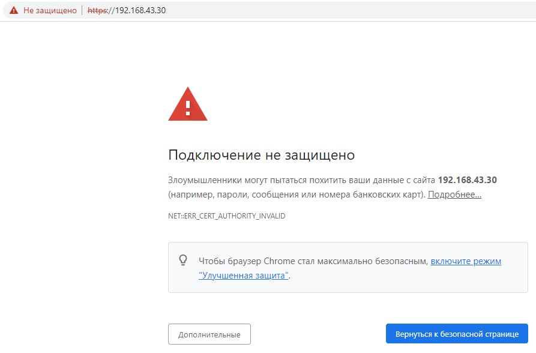  
   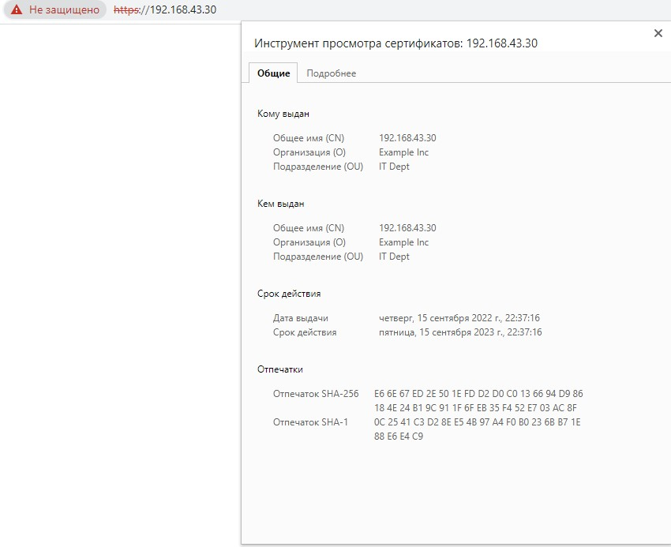  
   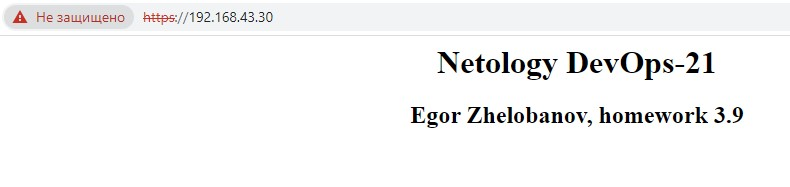  
4. Клонировал репозиторий с программой проверки:
    ```shell
    egor@ubuntu1:~$ git clone --depth 1 https://github.com/drwetter/testssl.sh.git
    Cloning into 'testssl.sh'...
    remote: Enumerating objects: 104, done.
    remote: Counting objects: 100% (104/104), done.
    remote: Compressing objects: 100% (97/97), done.
    remote: Total 104 (delta 15), reused 36 (delta 6), pack-reused 0
    Receiving objects: 100% (104/104), 8.68 MiB | 2.35 MiB/s, done.
    Resolving deltas: 100% (15/15), done.
    ```  
   Перешел в папку `testssl.sh` и запустил проверку сайта `https://netology.ru`:
    ```shell
    egor@ubuntu1:~$ cd testssl.sh/
    egor@ubuntu1:~/testssl.sh$ ./testssl.sh -U --sneaky https://netology.ru
    
    ###########################################################
        testssl.sh       3.2rc1 from https://testssl.sh/dev/
        (de48956 2022-09-14 21:25:14)
    
          This program is free software. Distribution and
                 modification under GPLv2 permitted.
          USAGE w/o ANY WARRANTY. USE IT AT YOUR OWN RISK!
    
           Please file bugs @ https://testssl.sh/bugs/
    
    ###########################################################
    
     Using "OpenSSL 1.0.2-bad (1.0.2k-dev)" [~183 ciphers]
     on ubuntu1:./bin/openssl.Linux.x86_64
     (built: "Sep  1 14:03:44 2022", platform: "linux-x86_64")
    
    
    Testing all IPv4 addresses (port 443): 188.114.98.195 188.114.99.195
    --------------------------------------------------------------------------
     Start 2022-09-15 12:15:12        -->> 188.114.98.195:443 (netology.ru) <<--
    
     Further IP addresses:   188.114.99.195 2a06:98c1:3123:c000::3 2a06:98c1:3122:c000::3
     rDNS (188.114.98.195):  --
     Service detected:       HTTP
    
    
     Testing vulnerabilities
    
     Heartbleed (CVE-2014-0160)                not vulnerable (OK), no heartbeat extension
     CCS (CVE-2014-0224)                       not vulnerable (OK)
     Ticketbleed (CVE-2016-9244), experiment.  not vulnerable (OK)
     ROBOT                                     not vulnerable (OK)
     Secure Renegotiation (RFC 5746)           supported (OK)
     Secure Client-Initiated Renegotiation     not vulnerable (OK)
     CRIME, TLS (CVE-2012-4929)                not vulnerable (OK)
     BREACH (CVE-2013-3587)                    potentially NOT ok, "gzip" HTTP compression detected. - only supplied "/" tested
                                               Can be ignored for static pages or if no secrets in the page
     POODLE, SSL (CVE-2014-3566)               not vulnerable (OK)
     TLS_FALLBACK_SCSV (RFC 7507)              Downgrade attack prevention supported (OK)
     SWEET32 (CVE-2016-2183, CVE-2016-6329)    VULNERABLE, uses 64 bit block ciphers
     FREAK (CVE-2015-0204)                     not vulnerable (OK)
     DROWN (CVE-2016-0800, CVE-2016-0703)      not vulnerable on this host and port (OK)
                                               make sure you don't use this certificate elsewhere with SSLv2 enabled services, see
                                               https://search.censys.io/search?resource=hosts&virtual_hosts=INCLUDE&q=A3C7D9A8D3805171D99EA61F5C80B8ADF49B93BA21EBB492D78512BA254E90A5
     LOGJAM (CVE-2015-4000), experimental      not vulnerable (OK): no DH EXPORT ciphers, no DH key detected with <= TLS 1.2
     BEAST (CVE-2011-3389)                     TLS1: ECDHE-RSA-AES128-SHA AES128-SHA ECDHE-RSA-AES256-SHA
                                                     AES256-SHA DES-CBC3-SHA
                                               VULNERABLE -- but also supports higher protocols  TLSv1.1 TLSv1.2 (likely mitigated)
     LUCKY13 (CVE-2013-0169), experimental     potentially VULNERABLE, uses cipher block chaining (CBC) ciphers with TLS. Check patches
     Winshock (CVE-2014-6321), experimental    not vulnerable (OK)
     RC4 (CVE-2013-2566, CVE-2015-2808)        no RC4 ciphers detected (OK)
    
    
     Done 2022-09-15 12:16:50 [ 105s] -->> 188.114.98.195:443 (netology.ru) <<--
    
    --------------------------------------------------------------------------
     Start 2022-09-15 12:16:50        -->> 188.114.99.195:443 (netology.ru) <<--
    
     Further IP addresses:   188.114.98.195 2a06:98c1:3123:c000::3 2a06:98c1:3122:c000::3
     rDNS (188.114.99.195):  --
     Service detected:       HTTP
    
    
     Testing vulnerabilities
    
     Heartbleed (CVE-2014-0160)                not vulnerable (OK), no heartbeat extension
     CCS (CVE-2014-0224)                       not vulnerable (OK)
     Ticketbleed (CVE-2016-9244), experiment.  not vulnerable (OK)
     ROBOT                                     not vulnerable (OK)
     Secure Renegotiation (RFC 5746)           supported (OK)
     Secure Client-Initiated Renegotiation     not vulnerable (OK)
     CRIME, TLS (CVE-2012-4929)                not vulnerable (OK)
     BREACH (CVE-2013-3587)                    potentially NOT ok, "gzip" HTTP compression detected. - only supplied "/" tested
                                               Can be ignored for static pages or if no secrets in the page
     POODLE, SSL (CVE-2014-3566)               not vulnerable (OK)
     TLS_FALLBACK_SCSV (RFC 7507)              Downgrade attack prevention supported (OK)
     SWEET32 (CVE-2016-2183, CVE-2016-6329)    VULNERABLE, uses 64 bit block ciphers
     FREAK (CVE-2015-0204)                     not vulnerable (OK)
     DROWN (CVE-2016-0800, CVE-2016-0703)      not vulnerable on this host and port (OK)
                                               make sure you don't use this certificate elsewhere with SSLv2 enabled services, see
                                               https://search.censys.io/search?resource=hosts&virtual_hosts=INCLUDE&q=A3C7D9A8D3805171D99EA61F5C80B8ADF49B93BA21EBB492D78512BA254E90A5
     LOGJAM (CVE-2015-4000), experimental      not vulnerable (OK): no DH EXPORT ciphers, no DH key detected with <= TLS 1.2
     BEAST (CVE-2011-3389)                     TLS1: ECDHE-RSA-AES128-SHA AES128-SHA ECDHE-RSA-AES256-SHA
                                                     AES256-SHA DES-CBC3-SHA
                                               VULNERABLE -- but also supports higher protocols  TLSv1.1 TLSv1.2 (likely mitigated)
     LUCKY13 (CVE-2013-0169), experimental     potentially VULNERABLE, uses cipher block chaining (CBC) ciphers with TLS. Check patches
     Winshock (CVE-2014-6321), experimental    not vulnerable (OK)
     RC4 (CVE-2013-2566, CVE-2015-2808)        no RC4 ciphers detected (OK)
    
    
     Done 2022-09-15 12:18:32 [ 207s] -->> 188.114.99.195:443 (netology.ru) <<--
    
    --------------------------------------------------------------------------
    Done testing now all IP addresses (on port 443): 188.114.98.195 188.114.99.195
    ```
5. На втором сервере `ubuntu2` отсутствует ssh-server. Устанавливаю, проверяю статус, вижу что служба не запущена, запускаю ее и включаю ее в автозагрузку:  
    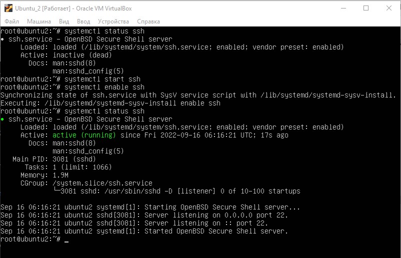
    SSH сервер работает, теперь я могу подключиться к нему из более удобной консоли:  
    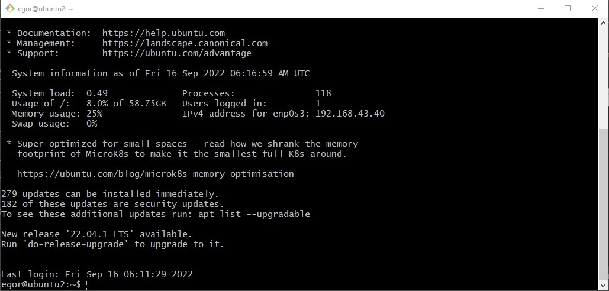
    Сгенерировал SSH-ключи:
    ```shell
    egor@ubuntu2:~$ ssh-keygen
    Generating public/private rsa key pair.
    Enter file in which to save the key (/home/egor/.ssh/id_rsa):
    Created directory '/home/egor/.ssh'.
    Enter passphrase (empty for no passphrase):
    Enter same passphrase again:
    Your identification has been saved in /home/egor/.ssh/id_rsa
    Your public key has been saved in /home/egor/.ssh/id_rsa.pub
    The key fingerprint is:
    SHA256:069gQlYdh/gYBl73/nBWXW44lgYWqmkoLHlrAZ0TGxo egor@ubuntu2
    The key's randomart image is:
    +---[RSA 3072]----+
    |  E o ....o.=.  .|
    |   + * .+o.* . +o|
    |  o = ...+o . * =|
    |   + . o.+.. o + |
    |  o = + S . o o  |
    |   o * . . . =   |
    |    o . o   . .  |
    |   .   o . .     |
    |          .      |
    +----[SHA256]-----+
    egor@ubuntu2:~$ ls ~/.ssh/
    id_rsa  id_rsa.pub
    ```
    Копирую SSH-ключ на первый сервер `ubuntu1`:
    ```shell
    egor@ubuntu2:~$ ssh-copy-id egor@192.168.43.30
    /usr/bin/ssh-copy-id: INFO: Source of key(s) to be installed: "/home/egor/.ssh/id_rsa.pub"
    The authenticity of host '192.168.43.30 (192.168.43.30)' can't be established.
    ECDSA key fingerprint is SHA256:JeTYoEvY6jG3QXftrHo0OgaXyLVhOjKdczA4uYTOWhc.
    Are you sure you want to continue connecting (yes/no/[fingerprint])? yes
    /usr/bin/ssh-copy-id: INFO: attempting to log in with the new key(s), to filter out any that are already installed
    /usr/bin/ssh-copy-id: INFO: 1 key(s) remain to be installed -- if you are prompted now it is to install the new keys
    egor@192.168.43.30's password:
    
    Number of key(s) added: 1
    
    Now try logging into the machine, with:   "ssh 'egor@192.168.43.30'"
    and check to make sure that only the key(s) you wanted were added.
   ```
    Проверяю подключение до сервера по ключу - все прекрасно работает:  
    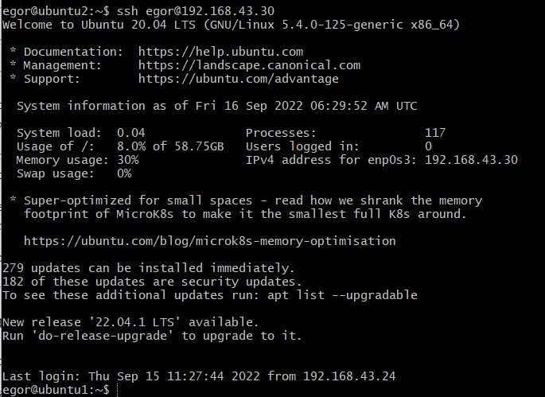
6. Переименовал ключ SSH, настроил файл конфигурации:
    ```shell
    egor@ubuntu2:~$ mv .ssh/id_rsa .ssh/id_ubuntu1
    egor@ubuntu2:~$ touch ~/.ssh/config && chmod 600 ~/.ssh/config
    egor@ubuntu2:~$ cat ~/.ssh/config
    Host ubuntu1
        HostName 192.168.43.30
        User egor
        IdentityFile ~/.ssh/id_ubuntu1
    ```
    Проверяю подключение к серверу `ubuntu1`, все работает:  
    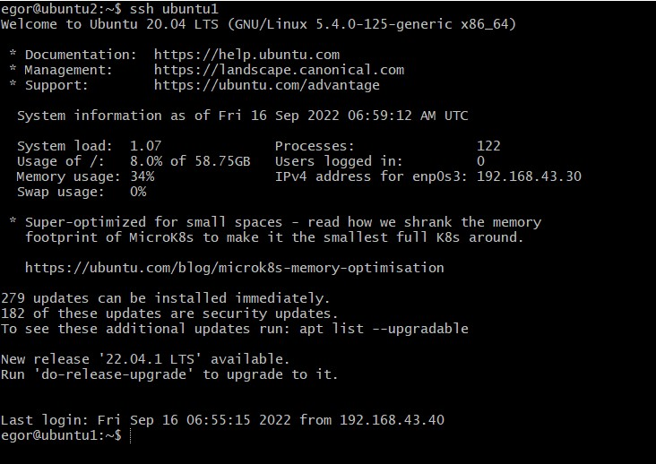
7. Установил утилиту `tcpdump`, запустил сбор дампа трафика, 100 пакетов, запись в файл `001.pcap`:
    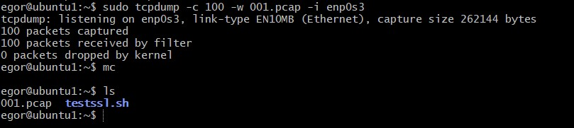  
    Открыл файл `001.pcap` в Wireshark:
    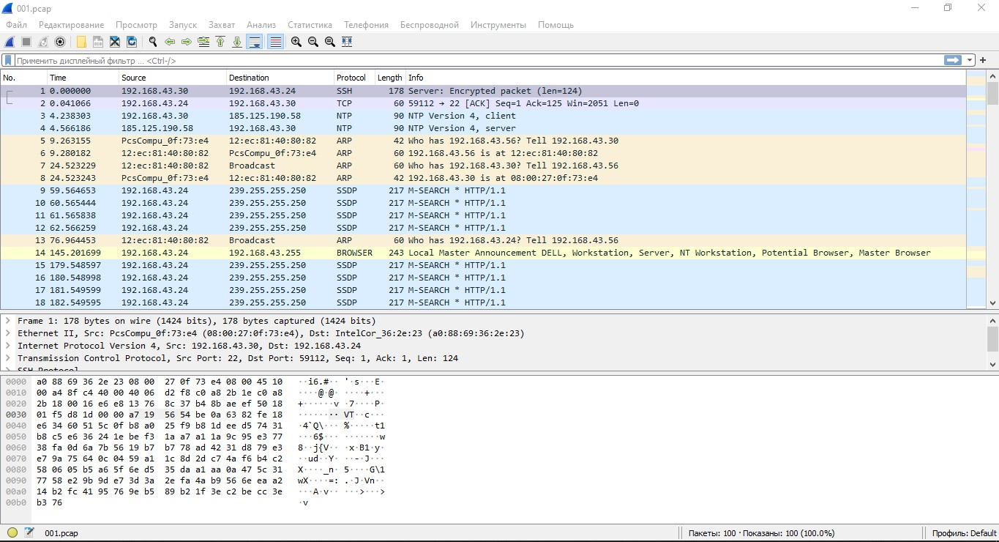  

## Необязательные задания:

8. Просканировал хост `scanme.nmap.org`. Там запущены `SSH` и `http`:
   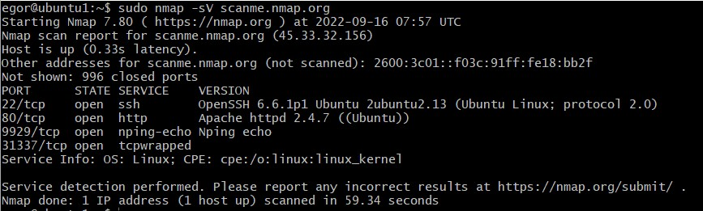 
9. Установил и настроил фаервол ufw на web-сервер из задания 3. Открыл доступ снаружи только к портам 22,80,443:
    ```shell
    root@ubuntu1:~# ufw allow ssh
    Rules updated
    Rules updated (v6)
    root@ubuntu1:~# ufw allow http
    Rules updated
    Rules updated (v6)
    root@ubuntu1:~# ufw allow https
    Rules updated
    Rules updated (v6)
    root@ubuntu1:~# ufw enable
    root@ubuntu1:~# ufw status verbose
    Status: active
    Logging: on (low)
    Default: deny (incoming), allow (outgoing), disabled (routed)
    New profiles: skip
    
    To                         Action      From
    --                         ------      ----
    22/tcp                     ALLOW IN    Anywhere
    80/tcp                     ALLOW IN    Anywhere
    443/tcp                    ALLOW IN    Anywhere
    22/tcp (v6)                ALLOW IN    Anywhere (v6)
    80/tcp (v6)                ALLOW IN    Anywhere (v6)
    443/tcp (v6)               ALLOW IN    Anywhere (v6)
    ```
