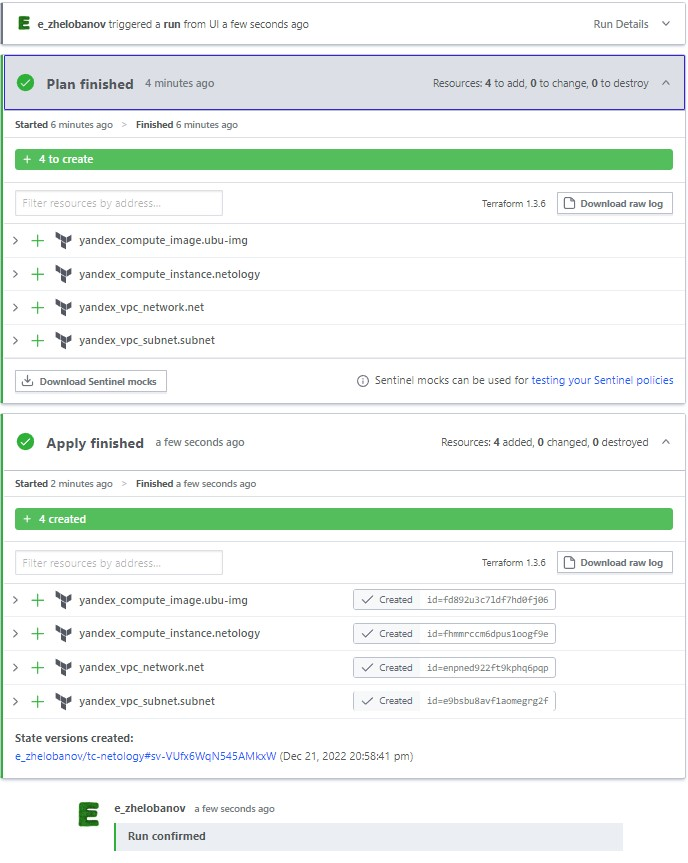
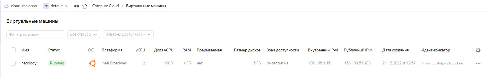

# devops-netology
### Желобанов Егор DEVOPS-21

# Домашнее задание к занятию "7.4. Средства командной работы над инфраструктурой."

### Задача 1. Настроить terraform cloud (необязательно, но крайне желательно).

В это задании предлагается познакомиться со средством командой работы над инфраструктурой предоставляемым
разработчиками терраформа. 

1. Зарегистрируйтесь на [https://app.terraform.io/](https://app.terraform.io/).
(регистрация бесплатная и не требует использования платежных инструментов).
2. Создайте в своем github аккаунте (или другом хранилище репозиториев) отдельный репозиторий с
 конфигурационными файлами прошлых занятий (или воспользуйтесь любым простым конфигом).
3. Зарегистрируйте этот репозиторий в [https://app.terraform.io/](https://app.terraform.io/).
4. Выполните plan и apply. 

В качестве результата задания приложите снимок экрана с успешным применением конфигурации.

#### Ответ:
1. Зарегистрировался
2. Создал отдельный [репозиторий на github](https://github.com/E-zh/tc-netology)
3. Зарегистрировал репозиторий в [https://app.terraform.io/](https://app.terraform.io/).
4. Выполнил `plan` и `apply`:  

5. Видим что в панели управления Yandex.Cloud создалась виртуальная машина:  


### Задача 2. Написать серверный конфиг для атлантиса. 

Смысл задания – познакомиться с документацией 
о [серверной](https://www.runatlantis.io/docs/server-side-repo-config.html) конфигурации и конфигурации уровня 
 [репозитория](https://www.runatlantis.io/docs/repo-level-atlantis-yaml.html).

Создай `server.yaml` который скажет атлантису:
1. Укажите, что атлантис должен работать только для репозиториев в вашем github (или любом другом) аккаунте.
2. На стороне клиентского конфига разрешите изменять `workflow`, то есть для каждого репозитория можно 
будет указать свои дополнительные команды. 
3. В `workflow` используемом по-умолчанию сделайте так, что бы во время планирования не происходил `lock` состояния.

Создай `atlantis.yaml` который, если поместить в корень terraform проекта, скажет атлантису:
1. Надо запускать планирование и аплай для двух воркспейсов `stage` и `prod`.
2. Необходимо включить автопланирование при изменении любых файлов `*.tf`.

В качестве результата приложите ссылку на файлы `server.yaml` и `atlantis.yaml`.

#### Ответ:
Ссылки на файлы прилагаю:
* [atlantis.yaml](https://github.com/E-zh/tc-netology/blob/main/atlantis.yaml)
* [server.yaml](https://github.com/E-zh/tc-netology/blob/main/server.yaml)

### Задача 3. Знакомство с каталогом модулей. 

1. В [каталоге модулей](https://registry.terraform.io/browse/modules) найдите официальный модуль от aws для создания
`ec2` инстансов. 
2. Изучите как устроен модуль. Задумайтесь, будете ли в своем проекте использовать этот модуль или непосредственно 
ресурс `aws_instance` без помощи модуля?
3. В рамках предпоследнего задания был создан ec2 при помощи ресурса `aws_instance`. 
Создайте аналогичный инстанс при помощи найденного модуля.   

В качестве результата задания приложите ссылку на созданный блок конфигураций.

#### Ответ:
Так как все задания выполнял в YandexCloud, то нашел модуль для Яндекса, но неофициальный, т.к. в списке его попросту нет.
Взял вот [этот модуль](https://registry.terraform.io/modules/glavk/compute/yandex/latest).

[Ссылка на main.tf](https://github.com/E-zh/tc-netology/blob/main/main.tf)
Конфигурация:  
```yaml
provider "yandex" {
  token     = var.yc_token
  cloud_id  = var.yc_cloud_id
  folder_id = var.yc_folder_id
  zone      = "ru-central1-a"
}

module "compute" {
  source  = "glavk/compute/yandex"
  version = "0.1.15"

  image_family = "ubuntu-2204-lts"
  subnet       = "subnetology"
  folder_id    = var.yc_folder_id

  name              = "netology"
  hostname          = "netology"
  is_nat            = false
  secondary_disk_id = ""

  cores  = 2
  memory = 4
  size   = "10"

  preemptible = false

  sg_id = ["default"]

}
```
По поводу использования модулей, думаю что если проект имеет сложную архитектуру с большим количеством зависимостей и ресурсов - то модули однозначно упростят работу. Но если необходимо развернуть 2-3 ресурса, то нет необходимости в использовании модулей.