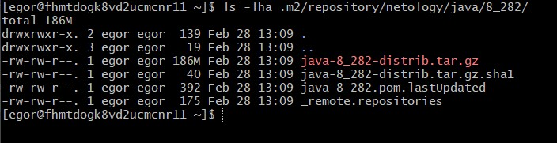

# devops-netology
### Желобанов Егор DEVOPS-21

# Домашнее задание к занятию "9.3. Процессы CI/CD"

## Подготовка к выполнению

1. Создаём 2 VM в yandex cloud со следующими параметрами: 2CPU 4RAM Centos7(остальное по минимальным требованиям)
2. Прописываем в [inventory](./infrastructure/inventory/cicd/hosts.yml) [playbook'a](./infrastructure/site.yml) созданные хосты
3. Добавляем в [files](./infrastructure/files/) файл со своим публичным ключом (id_rsa.pub). Если ключ называется иначе - найдите таску в плейбуке, которая использует id_rsa.pub имя и исправьте на своё
4. Запускаем playbook, ожидаем успешного завершения
5. Проверяем готовность Sonarqube через [браузер](http://localhost:9000)
6. Заходим под admin\admin, меняем пароль на свой
7.  Проверяем готовность Nexus через [бразуер](http://localhost:8081)
8. Подключаемся под admin\admin123, меняем пароль, сохраняем анонимный доступ

### Ответ:
1. Создал 2 VM с помощью terraform, файл [main.tf](../practice/09.3/terraform/main.tf)
2. Запустил `terraform apply`, прописал в [hosts.yml](../practice/09.3/infrastructure/inventory/cicd/hosts.yml) ip-адреса созданных VM.
3. Добавил свой `id_ed25519.pub` в директорию `files`.
4. Запустил playbook, дождался успешного завершения.
5. Проверил готовность Sonarqube:
     
6. Зашел под admin\admin, поменял пароль на свой.
7. Проверил готовность Nexus:
   
8. Зашел под admin\admin123, сиенил пароль, сохранил анонимный доступ.

## Знакомоство с SonarQube

### Основная часть

1. Создаём новый проект, название произвольное
2. Скачиваем пакет sonar-scanner, который нам предлагает скачать сам sonarqube
3. Делаем так, чтобы binary был доступен через вызов в shell (или меняем переменную PATH или любой другой удобный вам способ)
4. Проверяем `sonar-scanner --version`
5. Запускаем анализатор против кода из директории [example](./example) с дополнительным ключом `-Dsonar.coverage.exclusions=fail.py`
6. Смотрим результат в интерфейсе
7. Исправляем ошибки, которые он выявил(включая warnings)
8. Запускаем анализатор повторно - проверяем, что QG пройдены успешно
9. Делаем скриншот успешного прохождения анализа, прикладываем к решению ДЗ

### Ответ:
1. Создал новый проект `netology-progect`.
2. Скачал пакет `sonar-scanner`.
3. Изменил переменную PATH, добавил путь до `sonar-scanner`.
4. Проверяем `sonar-scanner --version`:
   ```shell
   [egor@fhm47c5dti9034micujh ~]$ sonar-scanner --version
   INFO: Scanner configuration file: /opt/sonar-scanner/conf/sonar-scanner.properties
   INFO: Project root configuration file: NONE
   INFO: SonarScanner 4.8.0.2856
   INFO: Java 11.0.17 Eclipse Adoptium (64-bit)
   INFO: Linux 3.10.0-1160.80.1.el7.x86_64 amd64
   ```
5. Запустил анализатор кода в директории `example` командой:
   ```shell
   sonar-scanner \
     -Dsonar.projectKey=np \
     -Dsonar.sources=. \
     -Dsonar.host.url=http://51.250.85.101:9000 \
     -Dsonar.login=c724d5f6f99ed04bda17def7c04e677c7f673f3b\
     -Dsonar.coverage.exclusions=fail.py
   ```  
6. В интерфейсе показан результат:
     
7. Исправил ошибки в файле [fail.py](../practice/09.3/example/fail.py).
8. Запускаем анализатор повторно - проверяем, что QG пройдены успешно:  
     
9. На этом задание SonarQube выполнено.

## Знакомство с Nexus

### Основная часть

1. В репозиторий `maven-public` загружаем артефакт с GAV параметрами:
   1. groupId: netology
   2. artifactId: java
   3. version: 8_282
   4. classifier: distrib
   5. type: tar.gz
2. В него же загружаем такой же артефакт, но с version: 8_102
3. Проверяем, что все файлы загрузились успешно
4. В ответе присылаем файл `maven-metadata.xml` для этого артефекта

### Ответ:
1. Загрузил артефакты в репозиторий `maven-public`:  
   
2. ссылка на файл [maven-metadata.xml](../practice/09.3/nexus/maven-metadata.xml).

### Знакомство с Maven

### Подготовка к выполнению

1. Скачиваем дистрибутив с [maven](https://maven.apache.org/download.cgi)
2. Разархивируем, делаем так, чтобы binary был доступен через вызов в shell (или меняем переменную PATH или любой другой удобный вам способ)
3. Удаляем из `apache-maven-<version>/conf/settings.xml` упоминание о правиле, отвергающем http соединение( раздел mirrors->id: my-repository-http-unblocker)
4. Проверяем `mvn --version`
5. Забираем директорию [mvn](./mvn) с pom

### Ответ:
Подготовку к выполнению провел, результат выполнения команды `mvn --version`:
```shell
[egor@fhmtdogk8vd2ucmcnr11 ~]$ mvn --version
Apache Maven 3.9.0 (9b58d2bad23a66be161c4664ef21ce219c2c8584)
Maven home: /opt/maven
Java version: 1.8.0_362, vendor: Red Hat, Inc., runtime: /usr/lib/jvm/java-1.8.0-openjdk-1.8.0.362.b08-1.el7_9.x86_64/jre
Default locale: en_US, platform encoding: UTF-8
OS name: "linux", version: "3.10.0-1160.80.1.el7.x86_64", arch: "amd64", family: "unix"
```

### Основная часть

1. Меняем в `pom.xml` блок с зависимостями под наш артефакт из первого пункта задания для Nexus (java с версией 8_282)
2. Запускаем команду `mvn package` в директории с `pom.xml`, ожидаем успешного окончания
3. Проверяем директорию `~/.m2/repository/`, находим наш артефакт
4. В ответе присылаем исправленный файл `pom.xml`

### Ответ:
1. Поменял в файле [pom.xml](../practice/09.3/mvn/pom.xml) блок с зависимостями под наш артефакт из первого пункта задания для Nexus.
2. Запустил команду `mvn package` в директории с `pom.xml`, лог очень длинный, прилагаю скриншот окончания:
     
3. Проверяем директорию `~/.m2/repository/`, находим наш артефакт:
     
4. Ссылка на [файл pom.xml](../practice/09.3/mvn/pom.xml)
