# devops-netology
### Желобанов Егор DEVOPS-21

# Домашнее задание к занятию "09.4. Jenkins"

## Подготовка к выполнению

1. Создать 2 VM: для jenkins-master и jenkins-agent.
2. Установить jenkins при помощи playbook'a.
3. Запустить и проверить работоспособность.
4. Сделать первоначальную настройку.

### Ответ:
1. Создал 2 виртуальные машины с помощью `terraform`, [файл main.tf](../practice/09.4/terraform/main.tf) прилагаю.
2. Установил jenkins при помощи playbook'a (лог не маленький, привожу скриншот концовки):
    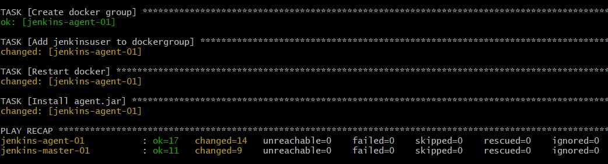  
3. в браузере перешел по адресу `http://158.160.63.204:8080`, разблокировал и установил плагины:
    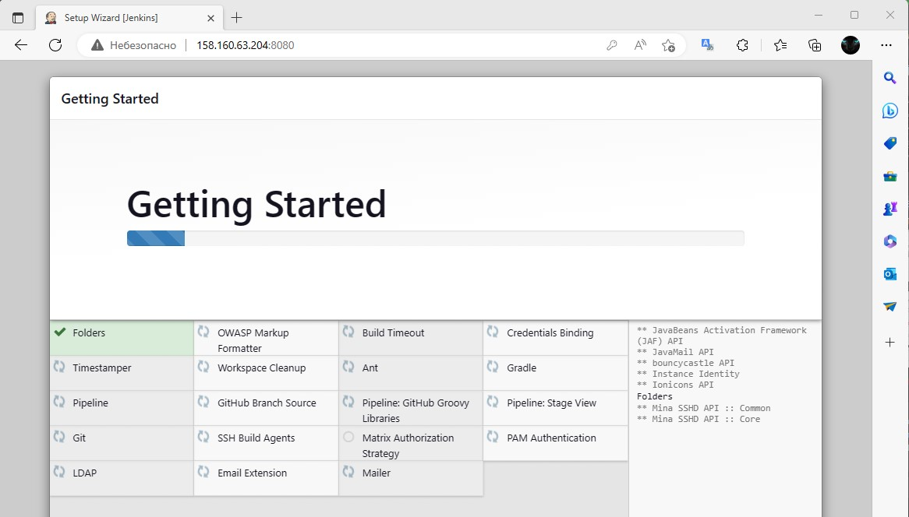  
4. Произвел первоначальную настройку, добавил агент `agent-nelology`, ввиду того что в способе запуска агента у меня отсутствовал пункт `launch agent via execution of command on the controller`, и победить это я не смог, настроил запуск на `Launch agent by connected it to the controller`:
    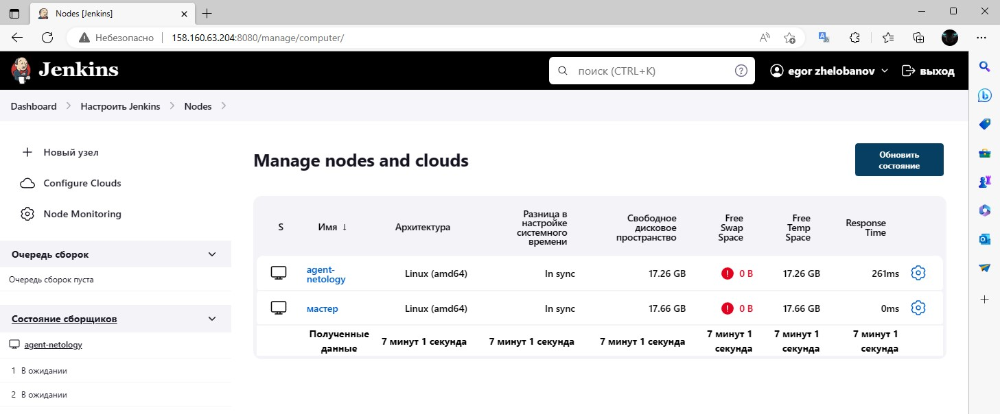  

## Основная часть

1. Сделать Freestyle Job, который будет запускать `molecule test` из любого вашего репозитория с ролью.
2. Сделать Declarative Pipeline Job, который будет запускать `molecule test` из любого вашего репозитория с ролью.
3. Перенести Declarative Pipeline в репозиторий в файл `Jenkinsfile`.
4. Создать Multibranch Pipeline на запуск `Jenkinsfile` из репозитория.
5. Создать Scripted Pipeline, наполнить его скриптом из [pipeline](../practice/09.4/pipeline).
6. Внести необходимые изменения, чтобы Pipeline запускал `ansible-playbook` без флагов `--check --diff`, если не установлен параметр при запуске джобы (prod_run = True), по умолчанию параметр имеет значение False и запускает прогон с флагами `--check --diff`.
7. Проверить работоспособность, исправить ошибки, исправленный Pipeline вложить в репозиторий в файл `ScriptedJenkinsfile`.
8. Отправить ссылку на репозиторий с ролью и Declarative Pipeline и Scripted Pipeline.

### Ответ:
1. Создал Freestyle Job с именем `freestyle-netology`:
    - 

Скриншот настроек freestyle-netology

        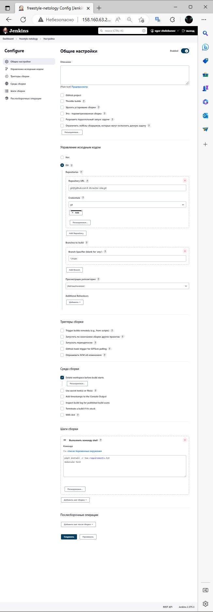

      
  
    Результат выполнения:  
    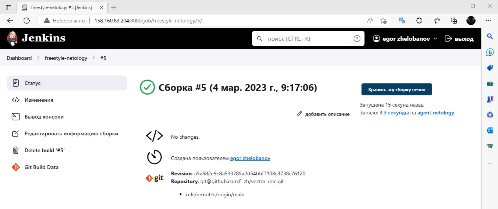
2. Создал Declarative Pipeline Job с именем `declarative-netology`:
    - 

Скриншот настроек declarative-netology

        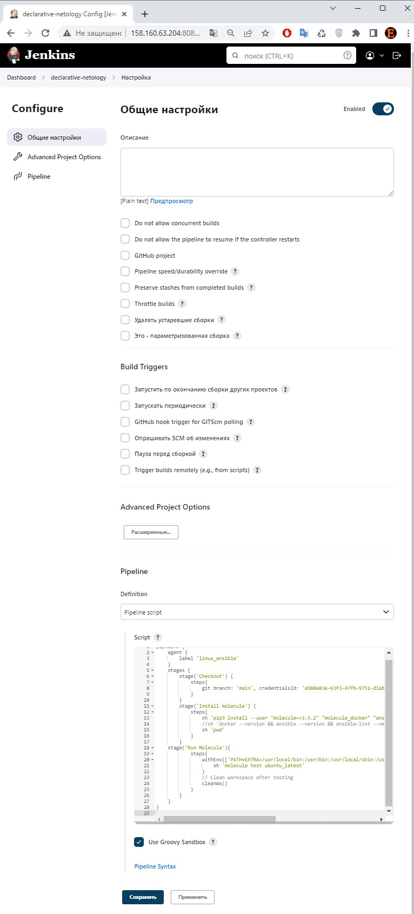

      
  
    Результат выполнения:  
    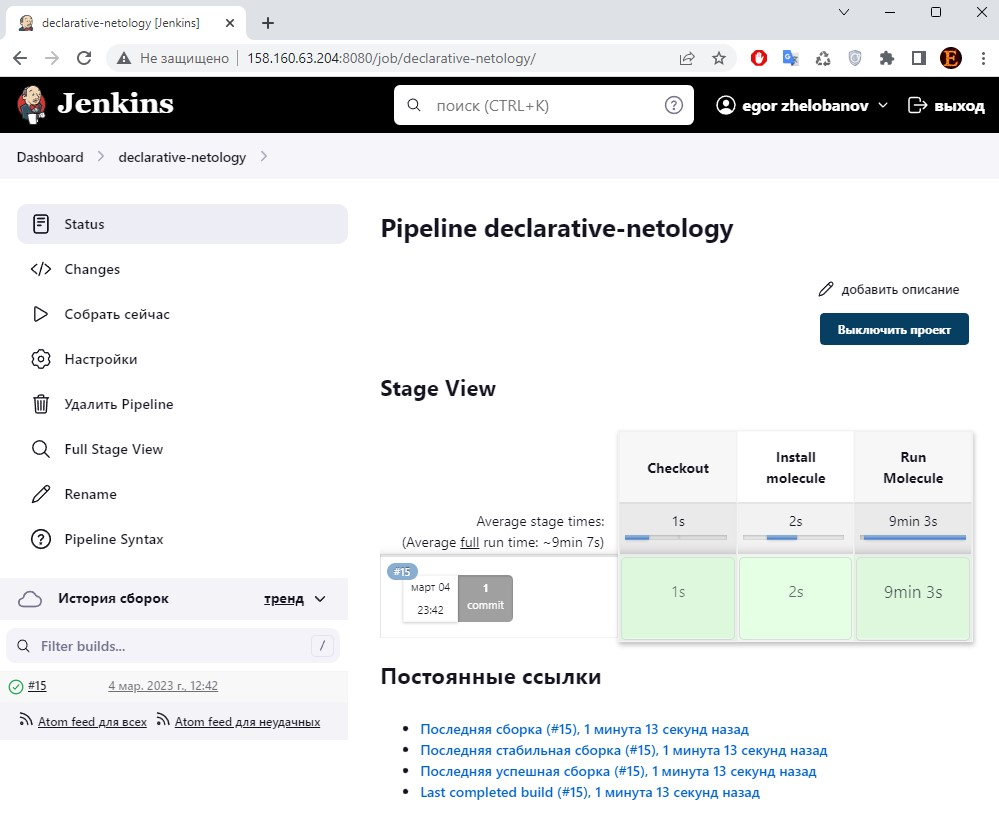  
    Содержимое скрипта также прилагаю в [файле declarative_pipeline](../practice/09.4/jenkins/declarative_pipeline).
3. Перенас Declarative Pipeline в репозиторий в [файл Jenkinsfile](https://github.com/E-zh/vector-role/blob/main/Jenkinsfile).
4. Создал Multibranch Pipeline на запуск `Jenkinsfile` из репозитория с именем `multibranch-netology`:
    - 

Скриншот лог сканирования multibranch-netology

        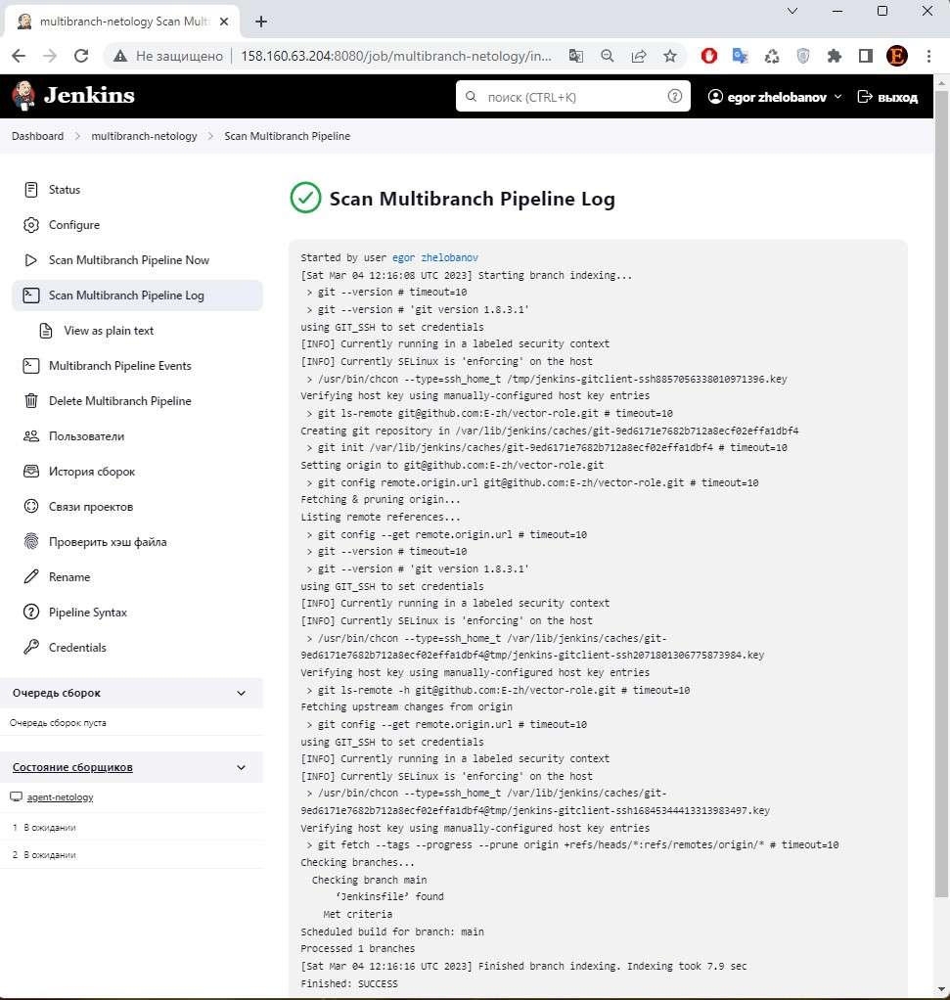

      

    - 

Скриншот настроек multibranch-netology

        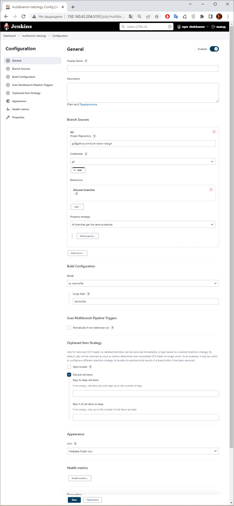

      

    Результат выполнения:  
    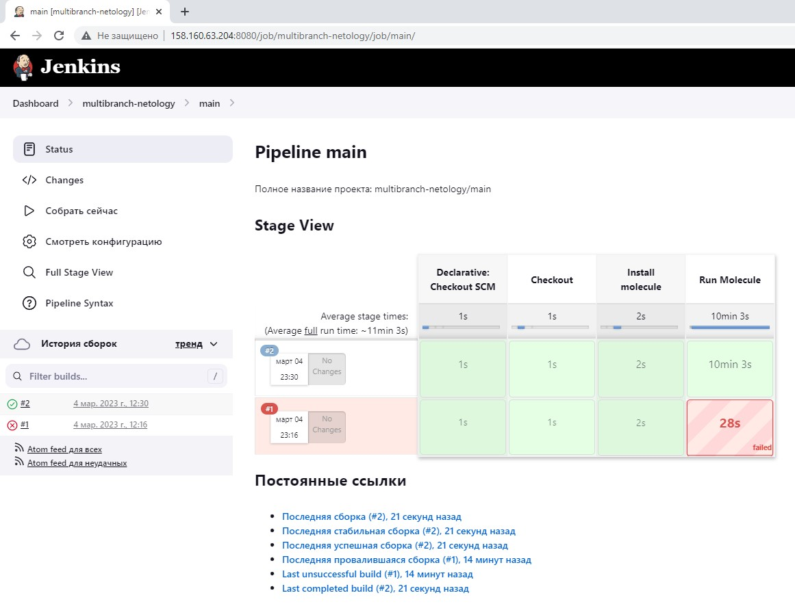  
5. Создал Scripted Pipeline, наполнил его скриптом из [pipeline](https://github.com/netology-code/mnt-homeworks/blob/MNT-video/09-ci-04-jenkins/pipeline/Jenkinsfile).  
6. Настроил проект, внес изменения:  
    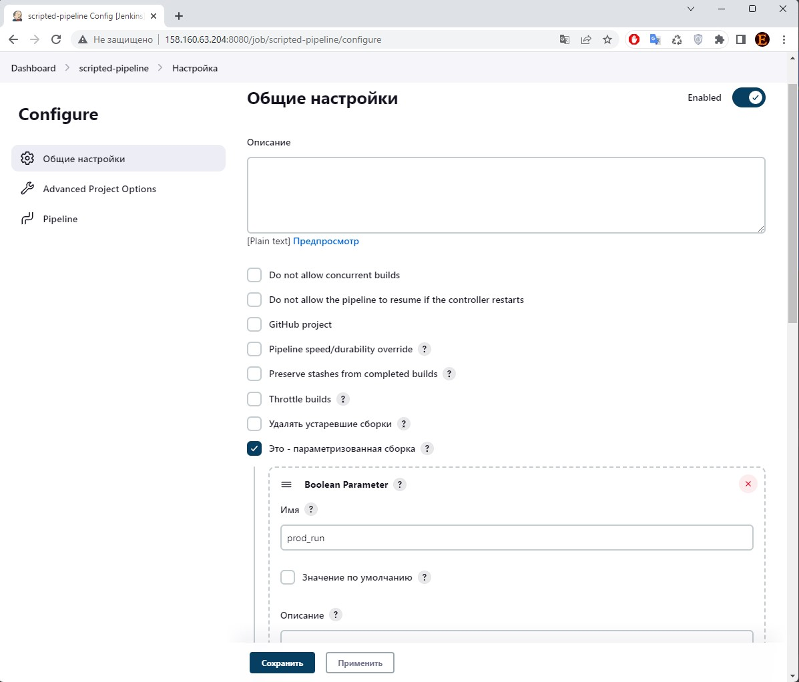  
7. Результат выполнения, запускал с параметром `prod_run` и без него:
    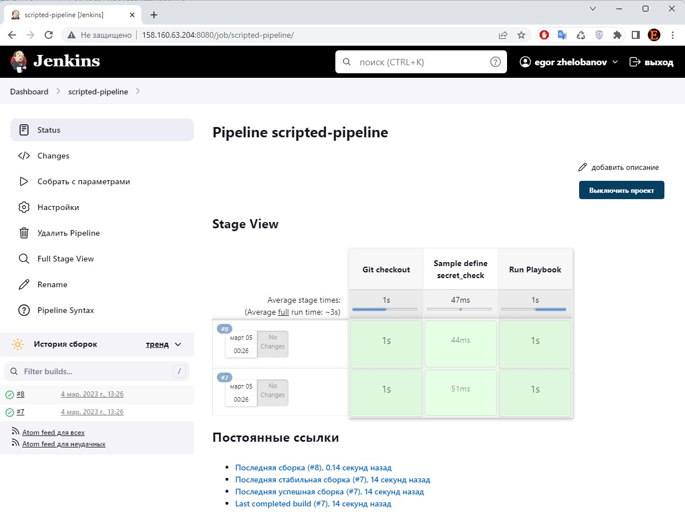  
8. Прилагаю ссылки на репозиторий с ролью и Declarative Pipeline и Scripted Pipeline:
    * [Declarative Pipeline](https://github.com/E-zh/vector-role/)
    * Scripted Pipeline, [файл ScriptedJenkinsfile](../practice/09.4/jenkins/ScriptedJenkinsfile)
