# devops-netology
### Желобанов Егор DEVOPS-21

# Домашнее задание к занятию "9.5. Teamcity"

## Подготовка к выполнению

1. В Ya.Cloud создайте новый инстанс (4CPU4RAM) на основе образа `jetbrains/teamcity-server`
2. Дождитесь запуска teamcity, выполните первоначальную настройку
3. Создайте ещё один инстанс(2CPU4RAM) на основе образа `jetbrains/teamcity-agent`. Пропишите к нему переменную окружения `SERVER_URL: "http://<teamcity_url>:8111"`
4. Авторизуйте агент
5. Сделайте fork [репозитория](https://github.com/aragastmatb/example-teamcity)
6. Создать VM (2CPU4RAM) и запустить [playbook](./infrastructure)

### Ответ:
Задание выполняю повторно, в связи с поломкой мной сервера, стартовую страницу пропустил автоматом, в прошлый раз дошел до выполнения 6-го пункта. Все скриншоты заменил новыми, надеюсь ничего не упустил.

1. В Yandex.Cloud развернул 2 ВМ для `teamcity-server` и `teamcity-agent`, и ВМ для `nexus`:  
    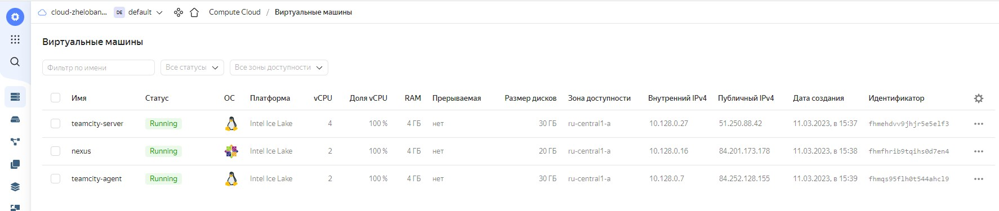  
2. Проверил доступность TeamCity по адресу `http://51.250.88.42:8111`:  
    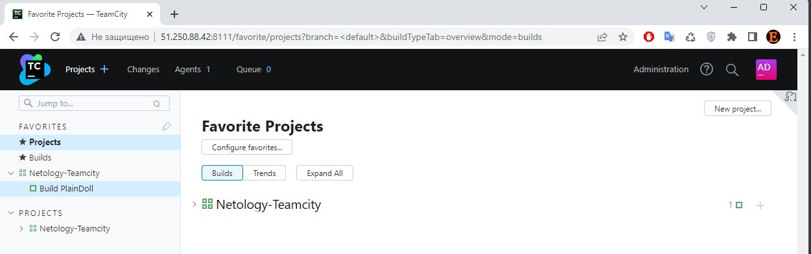  
3. Прописал публичный IP ВМ `nexus` в [файле hosts.yml](../practice/09.5/infrastructure/inventory/cicd/hosts.yml), запустил playbook:  
    ```shell
    egor@netology:~/Homeworks/09.5/infrastructure$ ansible-playbook -i inventory/cicd/hosts.yml site.yml
    
    PLAY [Get Nexus installed] **********************************************************************************************************
    
    TASK [Gathering Facts] **************************************************************************************************************
    ok: [nexus-01]
    
    TASK [Create Nexus group] ***********************************************************************************************************
    changed: [nexus-01]
    
    TASK [Create Nexus user] ************************************************************************************************************
    changed: [nexus-01]
    
    TASK [Install JDK] ******************************************************************************************************************
    changed: [nexus-01]
    
    TASK [Create Nexus directories] *****************************************************************************************************
    changed: [nexus-01] => (item=/home/nexus/log)
    changed: [nexus-01] => (item=/home/nexus/sonatype-work/nexus3)
    changed: [nexus-01] => (item=/home/nexus/sonatype-work/nexus3/etc)
    changed: [nexus-01] => (item=/home/nexus/pkg)
    changed: [nexus-01] => (item=/home/nexus/tmp)
    
    TASK [Download Nexus] ***************************************************************************************************************
    [WARNING]: Module remote_tmp /home/nexus/.ansible/tmp did not exist and was created with a mode of 0700, this may cause issues when
    running as another user. To avoid this, create the remote_tmp dir with the correct permissions manually
    changed: [nexus-01]
    
    TASK [Unpack Nexus] *****************************************************************************************************************
    changed: [nexus-01]
    
    TASK [Link to Nexus Directory] ******************************************************************************************************
    changed: [nexus-01]
    
    TASK [Add NEXUS_HOME for Nexus user] ************************************************************************************************
    changed: [nexus-01]
    
    TASK [Add run_as_user to Nexus.rc] **************************************************************************************************
    changed: [nexus-01]
    
    TASK [Raise nofile limit for Nexus user] ********************************************************************************************
    changed: [nexus-01]
    
    TASK [Create Nexus service for SystemD] *********************************************************************************************
    changed: [nexus-01]
    
    TASK [Ensure Nexus service is enabled for SystemD] **********************************************************************************
    changed: [nexus-01]
    
    TASK [Create Nexus vmoptions] *******************************************************************************************************
    changed: [nexus-01]
    
    TASK [Create Nexus properties] ******************************************************************************************************
    changed: [nexus-01]
    
    TASK [Lower Nexus disk space threshold] *********************************************************************************************
    skipping: [nexus-01]
    
    TASK [Start Nexus service if enabled] ***********************************************************************************************
    changed: [nexus-01]
    
    TASK [Ensure Nexus service is restarted] ********************************************************************************************
    skipping: [nexus-01]
    
    TASK [Wait for Nexus port if started] ***********************************************************************************************
    ok: [nexus-01]
    
    PLAY RECAP **************************************************************************************************************************
    nexus-01                   : ok=17   changed=15   unreachable=0    failed=0    skipped=2    rescued=0    ignored=0
    ```  
4. Сделал [форк](https://github.com/E-zh/example-teamcity) предложенного [репозитория](https://github.com/aragastmatb/example-teamcity).
5. Авторизовал агент:  
    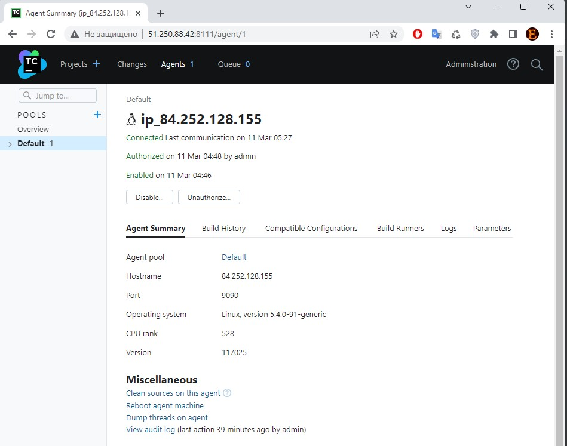  
6. На этом подготовка к выполнению основного задания закончена.

## Основная часть

1. Создайте новый проект в teamcity на основе fork
2. Сделайте autodetect конфигурации
3. Сохраните необходимые шаги, запустите первую сборку master'a
4. Поменяйте условия сборки: если сборка по ветке `master`, то должен происходит `mvn clean deploy`, иначе `mvn clean test`
5. Для deploy будет необходимо загрузить [settings.xml](./teamcity/settings.xml) в набор конфигураций maven у teamcity, предварительно записав туда креды для подключения к nexus
6. В pom.xml необходимо поменять ссылки на репозиторий и nexus
7. Запустите сборку по master, убедитесь что всё прошло успешно, артефакт появился в nexus
8. Мигрируйте `build configuration` в репозиторий
9. Создайте отдельную ветку `feature/add_reply` в репозитории
10. Напишите новый метод для класса Welcomer: метод должен возвращать произвольную реплику, содержащую слово `hunter`
11. Дополните тест для нового метода на поиск слова `hunter` в новой реплике
12. Сделайте push всех изменений в новую ветку в репозиторий
13. Убедитесь что сборка самостоятельно запустилась, тесты прошли успешно
14. Внесите изменения из произвольной ветки `feature/add_reply` в `master` через `Merge`
15. Убедитесь, что нет собранного артефакта в сборке по ветке `master`
16. Настройте конфигурацию так, чтобы она собирала `.jar` в артефакты сборки
17. Проведите повторную сборку мастера, убедитесь, что сбора прошла успешно и артефакты собраны
18. Проверьте, что конфигурация в репозитории содержит все настройки конфигурации из teamcity
19. В ответ предоставьте ссылку на репозиторий

### Ответ:
1. Создайте новый проект в teamcity на основе [fork](https://github.com/E-zh/example-teamcity):  
    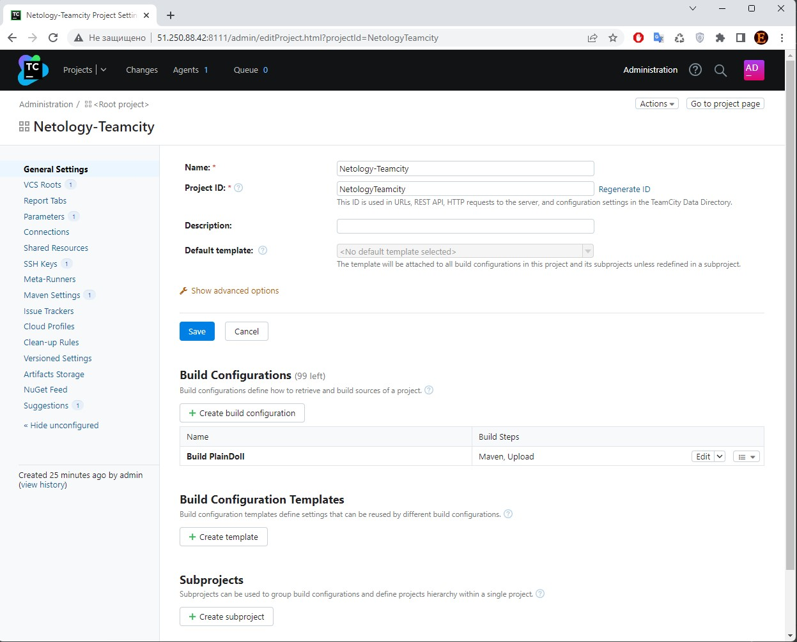  
2. Запустил autodetect конфигурации:  
    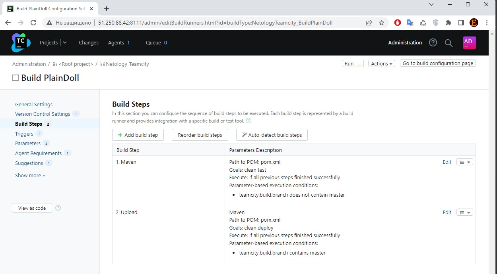   
3. Запустил первую сборку master'a:  
    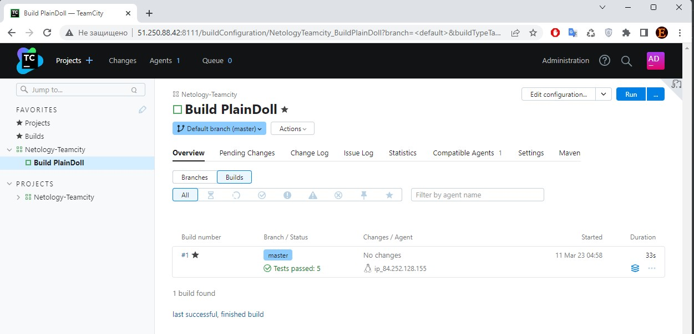  
4. Поменял условия сборки: если сборка по ветке `master`, то должен происходит `mvn clean deploy`, иначе `mvn clean test`:  
    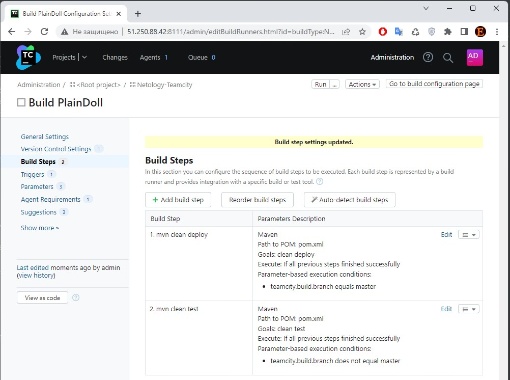  
5. Для deploy загрузил [settings.xml](../practice/09.5/teamcity/settings.xml):  
    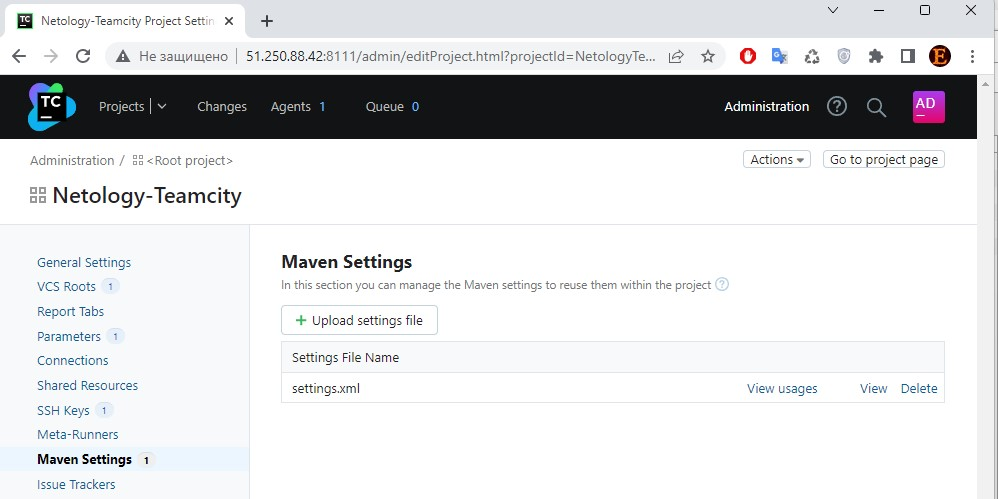  
6. В [pom.xml](https://github.com/E-zh/example-teamcity/blob/master/pom.xml) ссылку на `nexus` я поменял сразу, еще при просмотре видеоурока.
7. Запустил сборку, артефакт появился в nexus:  
    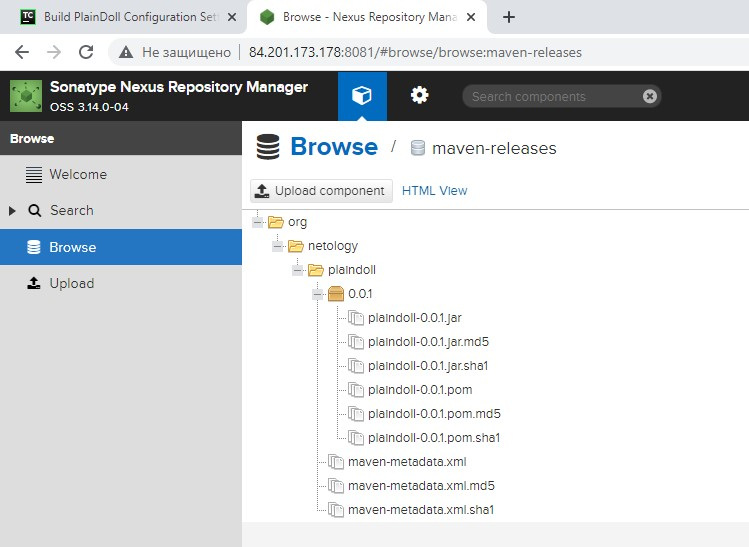  
8. Мигрировал `build configuration` в репозиторий:  
    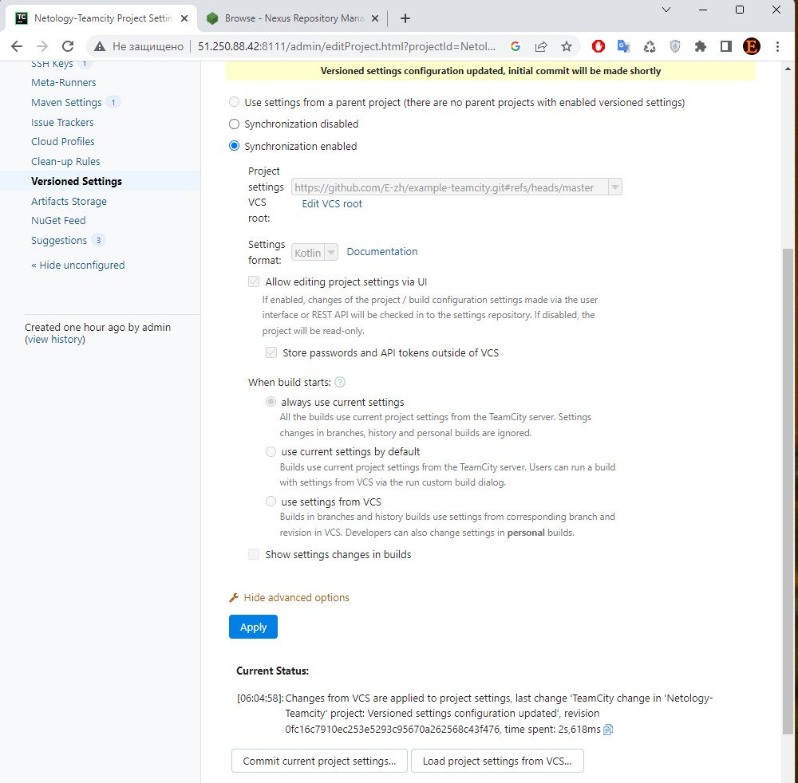  
9. Создал отдельную ветку `feature/add_reply` в репозитории:  
    ```shell
    egor@netology:~/Homeworks/09.5/example-teamcity$ git checkout -b feature/add_reply
    Switched to a new branch 'feature/add_reply'
    ```  
10. Написал новый метод для класса Welcomer: метод должен возвращать произвольную реплику, содержащую слово `hunter`:
    ```java
    public String sayHunter() {
	        return "Every hunter knows where the pheasant sits";
	}
    ```  
11. Дополнил тест для нового метода на поиск слова `hunter` в новой реплике:  
    ```java
    @Test
    public void welcomerSaysHunter() {
        assertThat(welcomer.sayWelcome(), containsString("hunter"));
        assertThat(welcomer.sayFarewell(), containsString("hunter"));
        assertThat(welcomer.sayHunter(), containsString("hunter"));
    }
    ``` 
12. Сделал push всех изменений в новую ветку в репозиторий:  
    ```shell
    egor@netology:~/Homeworks/09.5/example-teamcity$ git status
    On branch feature/add_reply
    Changes not staged for commit:
      (use "git add <file>..." to update what will be committed)
      (use "git restore <file>..." to discard changes in working directory)
            modified:   src/main/java/plaindoll/Welcomer.java
            modified:   src/test/java/plaindoll/WelcomerTest.java
    
    no changes added to commit (use "git add" and/or "git commit -a")
    egor@netology:~/Homeworks/09.5/example-teamcity$ git add *
    egor@netology:~/Homeworks/09.5/example-teamcity$ git commit -m "Created the new method sayHunter and test for this"
    [feature/add_reply 5e71a03] Created the new method sayHunter and test for this
     2 files changed, 5 insertions(+), 1 deletion(-)
    egor@netology:~/Homeworks/09.5/example-teamcity$ git branch
    * feature/add_reply
      master
    egor@netology:~/Homeworks/09.5/example-teamcity$ git push origin feature/add_reply
    Enumerating objects: 20, done.
    Counting objects: 100% (20/20), done.
    Delta compression using up to 2 threads
    Compressing objects: 100% (6/6), done.
    Writing objects: 100% (11/11), 833 bytes | 833.00 KiB/s, done.
    Total 11 (delta 3), reused 0 (delta 0)
    remote: Resolving deltas: 100% (3/3), completed with 3 local objects.
    remote:
    remote: Create a pull request for 'feature/add_reply' on GitHub by visiting:
    remote:      https://github.com/E-zh/example-teamcity/pull/new/feature/add_reply
    remote:
    To github.com:E-zh/example-teamcity.git
      * [new branch]      feature/add_reply -> feature/add_reply
    egor@netology:~/Homeworks/09.5/example-teamcity$
     ```
13. Сборка запустилась самостоятельно, тесты прошли успешно:  
    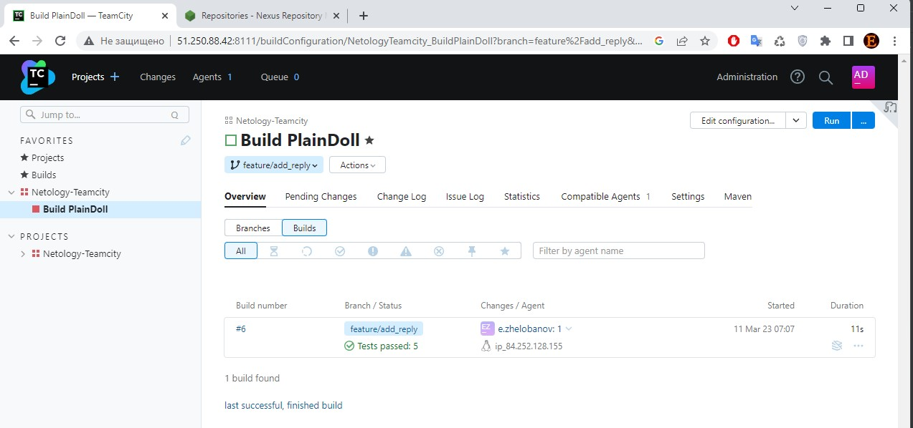  
14. Внес изменения из произвольной ветки `feature/add_reply` в `master` через `Merge`:  
    ```shell
    egor@netology:~/Homeworks/09.5/example-teamcity$ git merge feature/add_reply
    Updating 0fc16c7..557cbbf
    Fast-forward
     pom.xml                                   | 2 +-
     src/main/java/plaindoll/Welcomer.java     | 3 +++
     src/test/java/plaindoll/WelcomerTest.java | 3 ++-
     3 files changed, 6 insertions(+), 2 deletions(-)
    egor@netology:~/Homeworks/09.5/example-teamcity$ git push origin master
    Total 0 (delta 0), reused 0 (delta 0)
    To github.com:E-zh/example-teamcity.git
       0fc16c7..557cbbf  master -> master
    egor@netology:~/Homeworks/09.5/example-teamcity$
    ```  
15. Убедился что нет собранного артефакта в сборке по ветке master.
16. Настроил конфигурацию так, чтобы она собирала `.jar` в артефакты сборки:  
    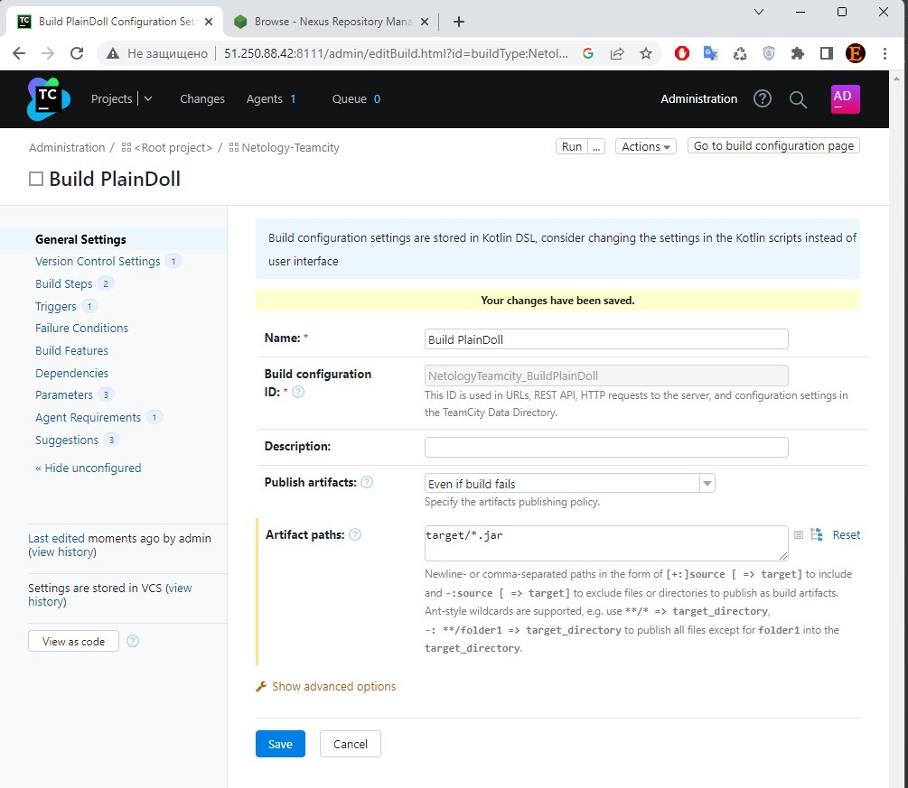  
17. Провел повторную сборку мастера, убедился, что сборка прошла успешно и артефакты собраны:  
    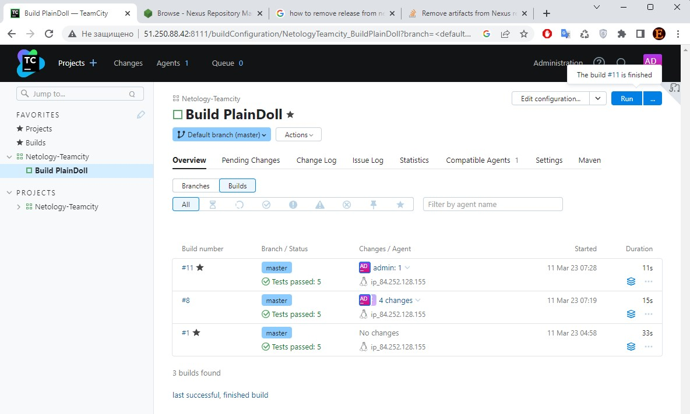  
18. Проверил, что конфигурация в репозитории содержит все настройки конфигурации из teamcity, прилагаю скрин [последнего коммита](https://github.com/E-zh/example-teamcity/commit/8d7365077e3e023b73d095d90be71cd85b985a18):  
    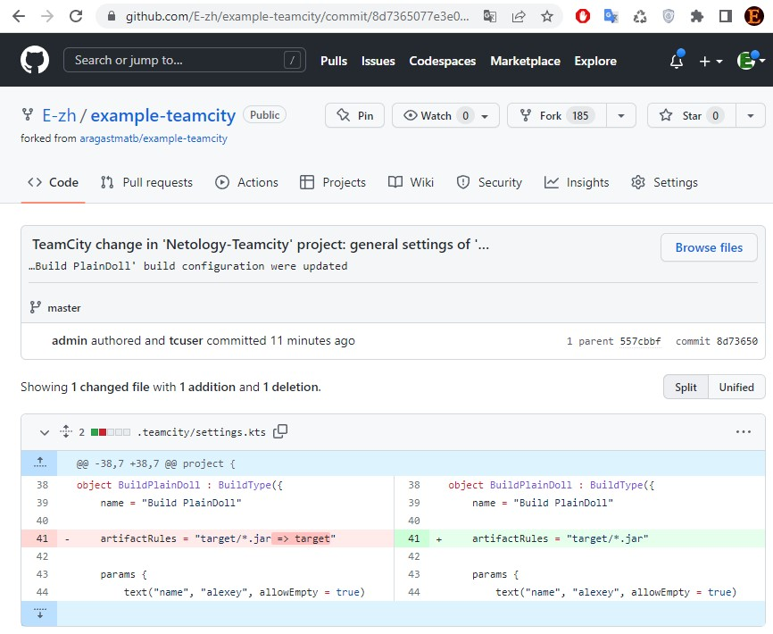  
19. Прилагаю [ссылку на репозиторий E-zh/example-teamcity](https://github.com/E-zh/example-teamcity). 
