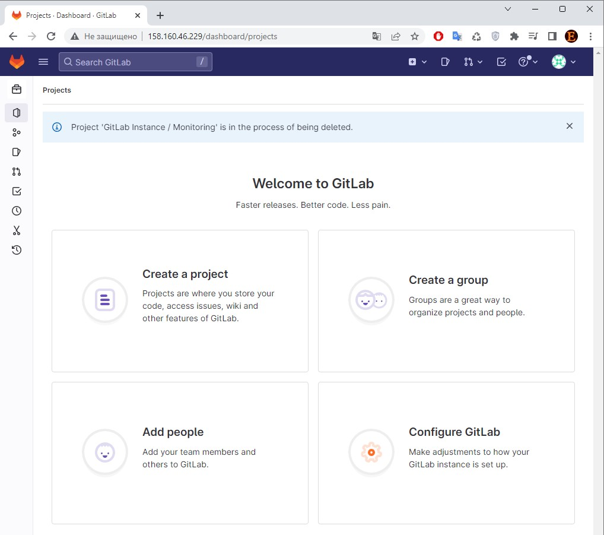
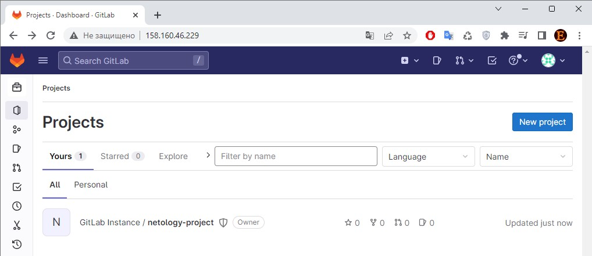
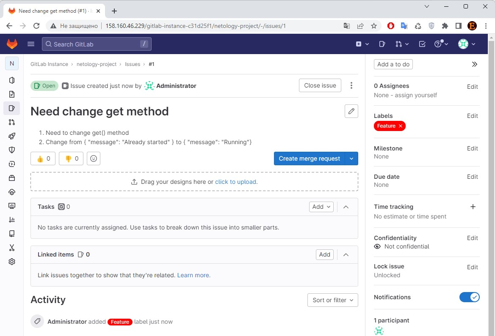
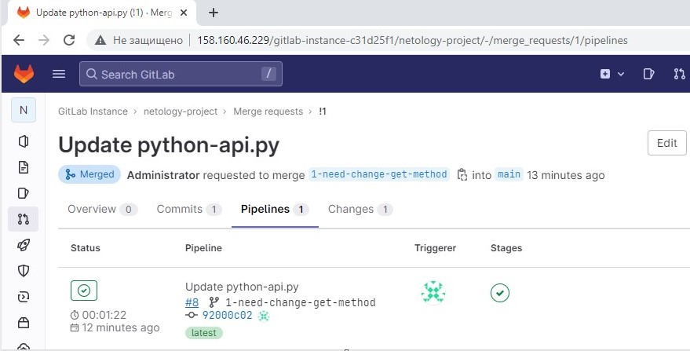
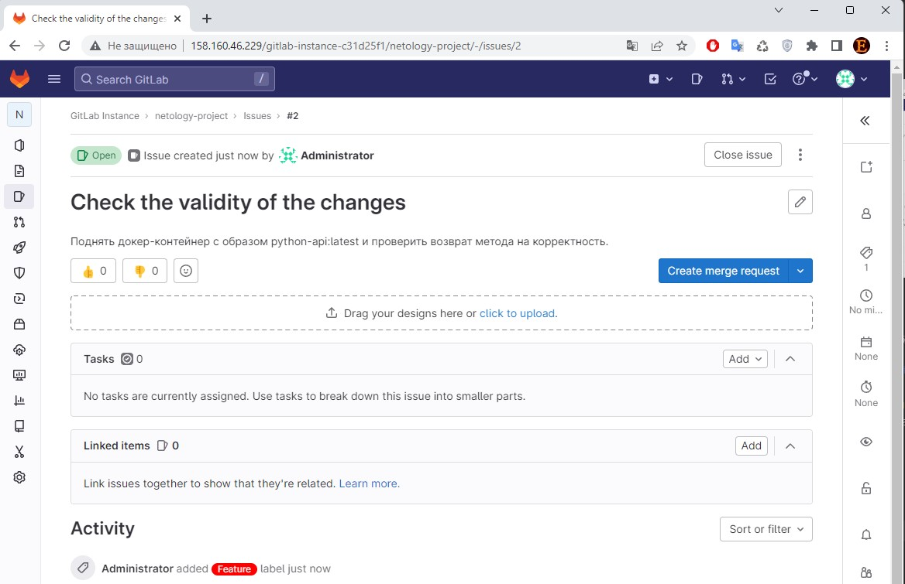
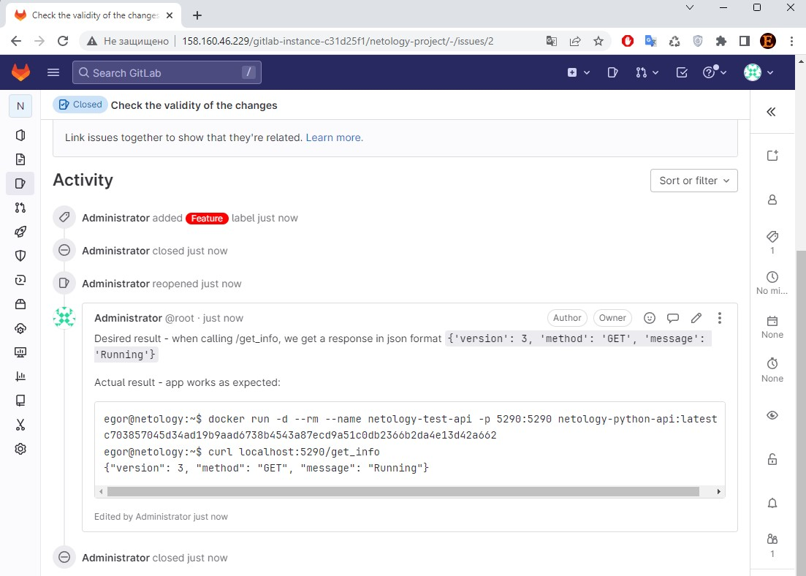

# devops-netology
### Желобанов Егор DEVOPS-21

# Домашнее задание к занятию "9.6. Gitlab"

## Подготовка к выполнению

1. Необходимо [подготовить gitlab к работе по инструкции](https://cloud.yandex.ru/docs/tutorials/infrastructure-management/gitlab-containers)
2. Создайте свой новый проект
3. Создайте новый репозиторий в gitlab, наполните его [файлами](./repository)
4. Проект должен быть публичным, остальные настройки по желанию

### Ответ:
1. Подготовил Gitlab, зашел, задал свой пароль:  
      
2. Создал новый проект `netology-project`:  
      
3. Создал репозиторий, загрузил файл из папки [repository](../practice/09.6/repository)
4. На этом подготовка закончена.

## Основная часть

### DevOps

В репозитории содержится код проекта на python. Проект - RESTful API сервис. Ваша задача автоматизировать сборку образа с выполнением python-скрипта:
1. Образ собирается на основе [centos:7](https://hub.docker.com/_/centos?tab=tags&page=1&ordering=last_updated)
2. Python версии не ниже 3.7
3. Установлены зависимости: `flask` `flask-jsonpify` `flask-restful`
4. Создана директория `/python_api`
5. Скрипт из репозитория размещён в /python_api
6. Точка вызова: запуск скрипта
7. Если сборка происходит на ветке `master`: должен подняться pod kubernetes на основе образа `python-api`, иначе этот шаг нужно пропустить

### Ответ:
Созданные в репозитории файлы:
* [Dockerfile](../practice/09.6/repository/Dockerfile)
* [python-api.py](../practice/09.6/repository/python-api.py)
* [.gitlab-ci.yml](../practice/09.6/repository/.gitlab-ci.yml)

### Product Owner

Вашему проекту нужна бизнесовая доработка: необходимо поменять JSON ответа на вызов метода GET `/rest/api/get_info`, необходимо создать Issue в котором указать:
1. Какой метод необходимо исправить
2. Текст с `{ "message": "Already started" }` на `{ "message": "Running"}`
3. Issue поставить label: feature

### Ответ:
Новый Issue создан:  
  

### Developer

Вам пришел новый Issue на доработку, вам необходимо:
1. Создать отдельную ветку, связанную с этим issue
2. Внести изменения по тексту из задания
3. Подготовить Merge Request, влить необходимые изменения в `master`, проверить, что сборка прошла успешно

### Ответ:
1. Создал ветку `1-need-change-get-method`.
2. Внес изменения по тексту задания в методе `get()`.
3. Подготовил Merge Request, слил необходимые изменения в ветку `main`, сборка прошла успешно:  
       


### Tester

Разработчики выполнили новый Issue, необходимо проверить валидность изменений:
1. Поднять докер-контейнер с образом `python-api:latest` и проверить возврат метода на корректность
2. Закрыть Issue с комментарием об успешности прохождения, указав желаемый результат и фактически достигнутый

### Ответ:

1. Создан новый Issue:  
      
2. Поднял докер-контейнер с образом `python-api:latest` и проверил возврат метода на корректность:
    ```shell
    egor@netology:~$ docker run -d --rm --name netology-test-api -p 5290:5290 netology-python-api:latest
    c703857045d34ad19b9aad6738b4543a87ecd9a51c0db2366b2da4e13d42a662
    egor@netology:~$ curl localhost:5290/get_info
    {"version": 3, "method": "GET", "message": "Running"}
   ```  
3. Закрыл Issue с комментарием об успешности прохождения, указав желаемый результат и фактически достигнутый:  
      
